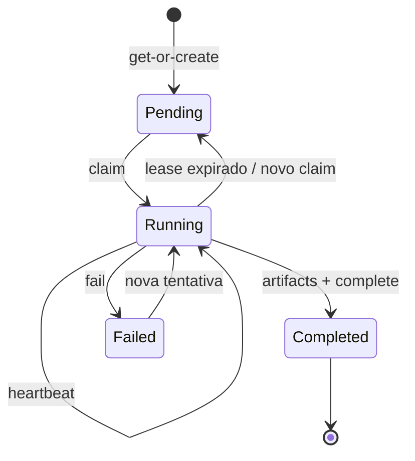

# Transações, idempotência e concorrência

[Documentação](../../README.md) · [Uso](../../operational/README.md) ·
[Local](../../operational/local/README.md) ·
[Dev catalogado](../../operational/cataloged-development/README.md) ·
[Produção](../../operational/production/README.md) ·
[Documentação técnica](../README.md)

## Chave idempotente

A chave de um stage é derivada de:

```text
revision_id
+ stage
+ processor/version
+ hash da configuração
+ hashes dos inputs
```

`POST /v1/stage-runs/get-or-create` usa constraint única e row lock no
PostgreSQL. Requisições concorrentes recebem o mesmo stage run; somente o
detentor do lease executa.

## Ciclo de estado



Cada claim incrementa a tentativa usada como fencing token. Status,
heartbeat, falha e conclusão exigem owner + tentativa. Um worker obsoleto não
pode concluir uma tentativa assumida por outro.

Transições repetidas ou atrasadas são idempotentes e nunca fazem o estado
regredir. Isso permite recuperar uma resposta HTTP perdida depois de um commit
durável.

## Conclusão

Depois do upload confirmado, artifacts e status `completed` são gravados na
mesma transação. A tabela outbox também é escrita nessa transação.

O dispatcher/integração Temporal ainda não está implementado. Hoje a outbox é
um registro transacional para consumidores futuros, não uma fila ativa.

O manifesto S3 é publicado por último. Como o backend S3 local não oferece uma
premissa portátil de conditional `PutObject`, ele não substitui locks,
constraints e fencing do PostgreSQL.

## Contratos HTTP

| Endpoint | Papel |
| --- | --- |
| `POST /v1/inventory-snapshots` | cria ou recupera snapshot |
| `POST /v1/inventory-snapshots/{id}/documents` | importa lote |
| `POST /v1/inventory-snapshots/{id}/activate` | valida e ativa |
| `POST /v1/stage-runs/get-or-create` | resolve idempotência e lease |
| `GET /v1/stage-runs/by-idempotency/{key}` | reconcilia estado |
| `POST /v1/stage-runs/{id}/status` | avança estado |
| `POST /v1/stage-runs/{id}/heartbeat` | renova lease |
| `POST /v1/stage-runs/{id}/complete` | conclui com artifacts |
| `POST /v1/stage-runs/{id}/fail` | registra falha cercada |

## Dívida conhecida

Leases, capacidade de cliente, limites de endpoint, router, GPU e transfers
usam knobs diferentes cuja nomenclatura operacional ainda é opaca. Isso está
registrado, sem solução antecipada, no
[soft backlog de concorrência](../backlog/concurrency-model.md).

Anterior: [Visão geral](overview.md)
Próximo: [Persistência MinerU](mineru-persistence.md)
Operação relacionada: [Dev catalogado](../../operational/cataloged-development/README.md)
