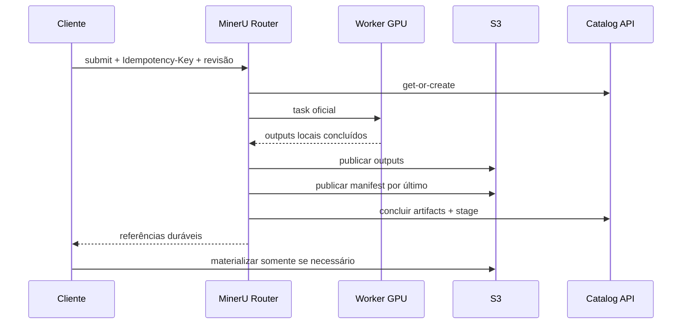

# Persistência MinerU e decisão do patch

[Documentação](../../README.md) · [Uso](../../operational/README.md) ·
[Local](../../operational/local/README.md) ·
[Dev catalogado](../../operational/cataloged-development/README.md) ·
[Produção](../../operational/production/README.md) ·
[Documentação técnica](../README.md)

## Decisão

Manter temporariamente um patch delimitado e versionado para MinerU 3.4.4. Ele
intercepta os pontos privados estritamente necessários: criação do diretório de
output, sinalização de conclusão e submit/registro do router para transportar a
chave idempotente e os metadados do catálogo.

Regras de idempotência, catálogo, S3, retry e reconciliação pertencem aos
adapters BaseIA, não ao motor de parsing.

## Motivação

O comportamento remoto padrão do MinerU mantém tasks em memória e devolve um
ZIP ao cliente. Em cargas de aproximadamente 120 requisições, isso prolonga
polling/download, concentra cópias no cliente e torna uma perda de socket
difícil de distinguir de perda da task.

Referências:

- [MinerU: API assíncrona, retenção e router multi-GPU](https://github.com/opendatalab/MinerU/blob/master/docs/en/usage/quick_usage.md)
- [HTTPX: pooling com Client](https://www.python-httpx.org/advanced/clients/)
- [Boto3: transfers concorrentes](https://boto3.amazonaws.com/v1/documentation/api/latest/guide/s3.html#file-transfer-configuration)

## Fluxo BaseIA

O PDF de entrada não faz parte do pacote MinerU persistido: sua key canônica
já existe no object storage. Cópias em `uploads/` são entradas efêmeras e são
descartadas depois do commit dos outputs.

Uma API MinerU oficial sem `/baseia-capabilities` é rejeitada cedo por
`poe extract`. Ela continua apropriada para sandbox com o CLI oficial e ZIP,
mas não promete a identidade e persistência deste pipeline.

## Dois perfis S3

O S3 canônico da coleção e o result store MinerU podem coincidir ou não:

- `BASEIA_S3_*` e `AWS_*`: promoção, catálogo e canônicos;
- `MINERU_RESULT_S3_*`: materialização dos outputs de um servidor GPU.

O `result_ref` retornado pelo servidor informa scheme, bucket e prefixo, mas
não endpoint nem credenciais. `ServiceProfile` persiste o endpoint acessível
pelo cliente e os nomes das variáveis de credencial. O cliente valida um
bucket esperado quando configurado e instancia o mesmo `S3ArtifactStore`
boto3 usado no restante do projeto.

Isso é necessário quando a GPU publica, por exemplo, em um MinIO dedicado,
enquanto o snapshot canônico reside em SeaweedFS ou AWS S3. Nenhum segredo é
serializado no YAML.

## Resiliência

O cliente usa um `httpx.Client` compartilhado com pool e keep-alive. Leases têm
fencing por tentativa e heartbeat; heartbeat renova o lease sem regredir o
estado.

Retenção do MinerU fica desabilitada até o commit durável. O pod aplica
backpressure quando o backlog chega a `MINERU_MAX_UNPERSISTED_TASKS` ou o disco
livre cai abaixo dos limites. `/baseia-persistence-health` expõe esse estado.

## Granularidade da persistência

A unidade de commit é uma task, não uma execução inteira de `poe extract`.
Assim que o worker conclui uma task, o reconciliador valida os outputs, envia
os payloads, confirma tamanho e SHA-256, publica o manifesto por último e só
então remove o diretório de trabalho.

Adiar todos os uploads até o fim da execução não é o default porque:

- o servidor pode atender várias execuções e clientes sem conhecer uma
  fronteira global confiável;
- Ctrl+C, reinício do container ou perda do host poderiam apagar todo o lote
  ainda não publicado;
- os outputs ocupariam disco até o fim e o upload produziria um pico de rede e
  uma cauda longa depois de a GPU ficar ociosa;
- o upload incremental se sobrepõe ao parsing das tasks seguintes;
- `stop` do cliente não constitui um commit distribuído do backend.

Se medições futuras mostrarem gargalo por objetos pequenos, a evolução segura
é um microbatch limitado por quantidade ou bytes, com flush periódico,
backpressure e shutdown gracioso que drene o backlog. Upload exclusivamente no
encerramento não preserva as garantias atuais.

## Uma imagem para uma ou várias GPUs

No MinerU 3.4.4, a opção pública é `--local-gpus auto`, `none` ou uma lista
como `0,1,2`; não existe `--gpus all`. Em `auto`, o router consulta as GPUs
visíveis e cria um `mineru-api` local por dispositivo. Com uma única GPU, ele
cria apenas `local-gpu-0` e mantém a mesma API e o mesmo balanceador.

O entrypoint BaseIA usa `MINERU_ROUTER_LOCAL_GPUS=auto` por padrão. Portanto, a
mesma imagem atende hosts com uma ou várias GPUs sem ramificar Dockerfile ou
entrypoint. Uma seleção explícita continua possível com uma lista de índices.

## Limites

O patch usa APIs privadas e falha no startup se a versão não for exatamente
3.4.4. Cada upgrade exige inspeção do wheel e smoke test. Quando MinerU
oferecer um hook público equivalente, o patch deve ser removido.

SeaweedFS não é usado como lock S3. Exclusão mútua e fencing pertencem ao
PostgreSQL. Consulte a
[discussão de compatibilidade de PutObject](https://github.com/seaweedfs/seaweedfs/discussions/5299).

## Performance e concorrência

Upload e materialização usam o TransferManager oficial. Upload, persistência,
download, pool HTTP, admissão por endpoint e limite do router são knobs
distintos. Essa distinção existe no código, mas sua taxonomia e UX ainda
precisam ser formalizadas:

- [TODO: modelo de concorrência e capacidade](../backlog/concurrency-model.md).

A persistência server-side remove o ZIP do caminho de resposta e reduz o
acoplamento do socket do cliente à duração da task. Ela não elimina custo:
acrescenta upload, HEAD/verificação e possível download para o render local.
O benefício cresce quando vários consumidores compartilham o mesmo store ou
quando reconciliação após perda de conexão evita reprocessamento GPU. Meça
separadamente tempo MinerU, persistência e materialização.

Os modelos ficam no volume `/opt/mineru/models`. A imagem deriva da variante
`runtime` oficial do PyTorch, com Python, CUDA e cuDNN; dependências são
resolvidas no build, nunca no boot.

Anterior: [Transações e concorrência](catalog.md)
Próximo: [Modelo do pipeline](../concepts/pipeline.md)
Operação relacionada: [Extração](../../operational/local/extraction.md)
