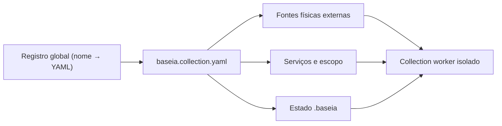
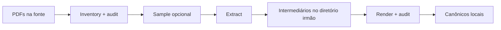
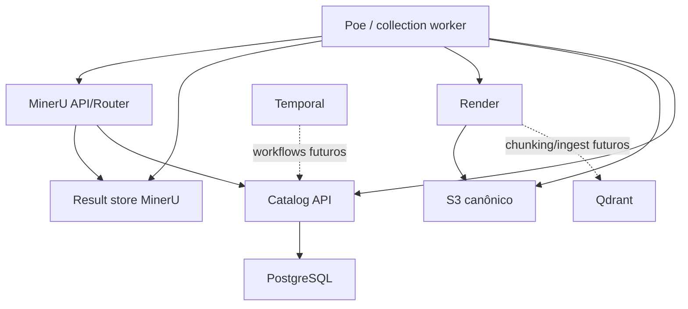

# Visão geral da arquitetura

[Documentação](../../README.md) · [Uso](../../operational/README.md) ·
[Local](../../operational/local/README.md) ·
[Dev catalogado](../../operational/cataloged-development/README.md) ·
[Produção](../../operational/production/README.md) ·
[Documentação técnica](../README.md)

O BaseIA separa contexto de trabalho, payload durável, metadados transacionais
e capacidade de processamento.

## Contexto de coleção

O registro global não é o catálogo: ele é apenas conveniência local para
alternar contextos. A coleção é declarada pelo YAML junto da fonte. O worker
recebe paths e variáveis próprias por subprocesso e usa um lock por coleção.

## Pipeline local

Inventário e amostragem não exigem serviços. Extract exige algum backend
MinerU, mas ele pode estar no host, em container ou remoto.

## Fluxo catalogado

O result store pode ser o mesmo S3 canônico ou outro endpoint. A referência da
task contém bucket/prefixo; endpoint e credenciais acessíveis pelo cliente vêm
do perfil da coleção.

## Responsabilidades

| Componente | Responsabilidade | Não deve fazer |
| --- | --- | --- |
| YAML/registro local | selecionar fontes, serviços e contexto | substituir o catálogo |
| PostgreSQL | identidade, snapshots, locks, leases e estados | armazenar payload |
| Catalog API | único writer de metadados canônicos | transferir pacotes |
| S3 canônico | PDFs, artefatos e snapshots publicados | atuar como fila ou lock |
| result store | intermediários persistidos pelo MinerU | definir identidade |
| MinerU | parsing e intermediários | produzir Markdown canônico |
| Render | IR, estrutura e canônicos | decidir identidade |
| Poe CLI | coordenação atual | fingir orquestração durável |
| Temporal/Qdrant | infraestrutura/etapas futuras | participar do pipeline atual |

## Modos, escopos e topologias

Esses eixos são relacionados, mas independentes:

- modo: `local`, `cataloged`, `production`;
- escopo de recursos: `personal`, `operator`, `client`;
- topologia: `local`, `services`, `distributed`;
- etapa-alvo: `inventory`, `extract`, `render`, `promote`.

Assim, uma coleção pessoal pode usar serviços distribuídos e uma consultoria
pode executar localmente. Um futuro conceito de workspace agrupará defaults
de várias coleções sem fundir suas identidades; consulte
[CTX-001](../backlog/workspace-contexts.md).

## Router e GPUs

Não existe serviço `mineru-router` separado no Compose. Cada container GPU
inicia o router oficial para as GPUs visíveis. Para vários hosts, o cliente
recebe várias URLs. A taxonomia dos limites ainda está no
[TODO de concorrência](../backlog/concurrency-model.md).

## Invariantes

- documento é coleção + path relativo;
- SHA-256 identifica revisão/integridade, não cria aliases;
- PDFs ficam na fonte e artefatos no diretório irmão;
- catálogo é o único writer de metadados;
- payloads precedem manifests e conclusão;
- render é o único produtor do Markdown canônico;
- produção recria registros;
- Qdrant e Temporal não são simulados enquanto forem futuros.

Anterior: [Estrutura do repositório](../repository-structure.md)
Próximo: [Transações e concorrência](catalog.md)
Operação relacionada: [Escolher um ambiente](../../operational/README.md)
