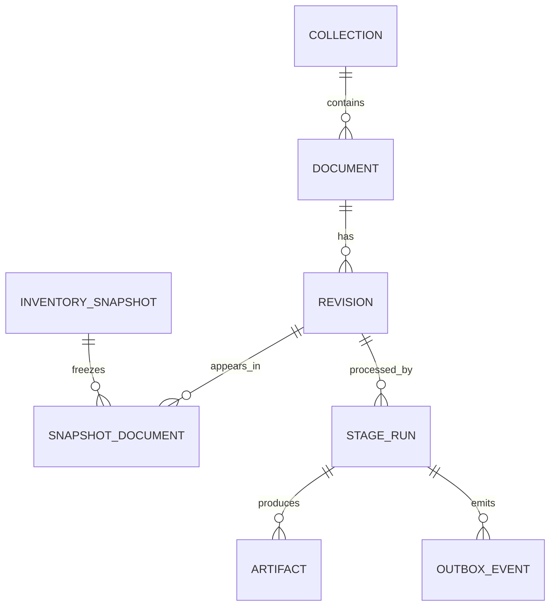

# Catálogo, inventário e identidade

[Documentação](../../README.md) · [Uso](../../operational/README.md) ·
[Local](../../operational/local/README.md) ·
[Dev catalogado](../../operational/cataloged-development/README.md) ·
[Produção](../../operational/production/README.md) ·
[Documentação técnica](../README.md)

## Entidades

O inventário descreve um snapshot da coleção. O catálogo registra:

- coleções;
- documentos;
- revisões;
- snapshots e seus membros;
- stage runs;
- artefatos;
- eventos transacionais de outbox.



## Identidade

Documento é identificado por coleção + caminho relativo. Dois paths diferentes
são dois documentos, mesmo que seus bytes sejam iguais. Não há aliases.

SHA-256 não é o ID do documento. Ele comprova integridade e participa da
identidade da revisão.

Exemplo:

```text
Coleção A/relatorio.pdf  sha256=abc...
Coleção B/relatorio.pdf  sha256=abc...
```

O conteúdo é igual, mas existem dois documentos e duas posições lógicas.

## Snapshots

Um snapshot só se torna ativo quando as contagens esperadas e persistidas
coincidem.

As associações snapshot–revisão e snapshot–artefato congelam a composição
exata do inventário. Uma mesma revisão pode reaparecer em snapshots futuros sem
alterar o snapshot anterior.

`artifacts` é a projeção atual por revisão + object key e pode avançar quando
um stage publica uma nova versão canônica. A associação do snapshot congela
key, SHA-256, tamanho, tipo e origem no momento da ativação.

Outputs criados depois não entram retroativamente em um snapshot. Para
congelar outro estado, crie outro snapshot.

## Bootstrap

`poe init` cria inventário novo a partir das fontes e não importa metadados
operacionais legados. UUIDv5 torna coleção, documento, revisão, artefato e
snapshot observavelmente idempotentes.

`bootstrap.py` permanece específico da consolidação histórica. A primitiva
`bootstrap_s3.py` é genérica: aceita um inventário validado, filtra coleções,
resolve um escopo, gera o snapshot determinístico, verifica uploads e usa a
Catalog API para ativação transacional.

## Escopo e substituição

Existe no máximo um snapshot ativo por `scope`. Ativar uma composição nova
marca o ativo anterior como `superseded`, sem apagá-lo. Escopos permitem que
coleções pessoais, operadas e de clientes compartilhem infraestrutura sem
compartilhar autoridade lógica.

O `resource_scope` do YAML (`personal`, `operator`, `client`) escolhe o perfil
operacional; o `scope` do snapshot é atualmente o slug da coleção. Coleções
legadas materializadas como `unassigned` precisam ser configuradas antes da
promoção.

## Registro local não é catálogo

O registro criado por `platformdirs` contém somente coleção atual e paths para
`baseia.collection.yaml`. Ele não guarda documentos, snapshots ou stage runs
e não participa da autoridade de produção.

Anterior: [Modelo do pipeline](pipeline.md)
Próximo: [Artefatos e layout](artifacts.md)
Operação relacionada: [Primeiro inventário](../../operational/local/inventory.md)
