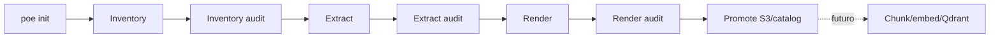

# Modelo do pipeline

[Documentação](../../README.md) · [Uso](../../operational/README.md) ·
[Local](../../operational/local/README.md) ·
[Dev catalogado](../../operational/cataloged-development/README.md) ·
[Produção](../../operational/production/README.md) ·
[Documentação técnica](../README.md)

O pipeline transforma fontes físicas em artefatos canônicos e snapshots sem
usar diretórios temporários como contrato entre serviços.

## Ciclo de vida implementado

`collection_worker.py` executa os checkpoints em subprocesso com o contexto da
coleção. Uma falha de auditoria interrompe a sequência.

## Stages

| Stage | Entrada | Saída | Dono |
| --- | --- | --- | --- |
| `inventory` | fontes PDF | CSV, integridade e manifesto validado | collection/inventory |
| `extract` | revisão e URL MinerU | intermediários e referências S3 | MinerU + adapter |
| `render` | `middle.json` | IR, estrutura, Markdown e proveniência | render |
| `promote` | inventário integral e manifests | objetos verificados e snapshot ativo | bootstrap_s3/catalog |

`ingest` aparece nas choices para demarcar a próxima etapa, mas falha
explicitamente. Chunking, embeddings e Qdrant não estão implementados.

## Amostras

`poe sample` cria apenas uma seleção referencial. `pipeline --sample` usa esse
CSV em inventory, extract, render e auditorias, sem copiar PDFs.

Promoção de amostra é proibida. Um snapshot ativo representa a coleção
integral. Para transformar a seleção em autoridade independente, ela deve ser
registrada como outra coleção.

## `init`, `pipeline` e `quick`

- `init`: cria coleção ou adiciona uma fonte; sempre inventaria e audita;
- `pipeline`: retoma ou avança até um checkpoint;
- `quick`: adiciona uma fonte e executa até a etapa-alvo vigente;
- `collection use`: muda somente o contexto padrão.

Adicionar uma fonte a coleção existente calcula a etapa observada antes da
mudança e conduz os novos documentos até ela. O lock de arquivo evita dois
workers locais simultâneos para a mesma coleção; ele não substitui leases do
catálogo em topologias distribuídas.

## Idempotência

- documento: UUID determinístico de coleção + path;
- revisão: documento + SHA-256;
- task MinerU: revisão, configuração e inputs;
- snapshot: escopo + hash do inventário serializado;
- upload: object key + SHA-256 + tamanho.

Uma repetição reconcilia tasks persistidas, ignora render atual e reutiliza
snapshot idêntico. Mudança de composição produz snapshot novo e preserva o
anterior.

## Propriedade do Markdown

Extract produz intermediários. O render é o único produtor de
`canonical/document.md`. O Markdown MinerU nunca é promovido como Markdown
final.

## Boundary de produção

Produção recria YAML, inventário, manifests, snapshots e runs. Apenas a
estratégia é reaplicada. O handoff de autoridade para um snapshot bruto antes
de extract/render ainda está no
[backlog](../backlog/production-authority-handoff.md).

Anterior: [Persistência MinerU](../architecture/mineru-persistence.md)
Próximo: [Catálogo e identidade](catalog.md)
Operação relacionada: [Quick Start](../../operational/local/quickstart.md)
