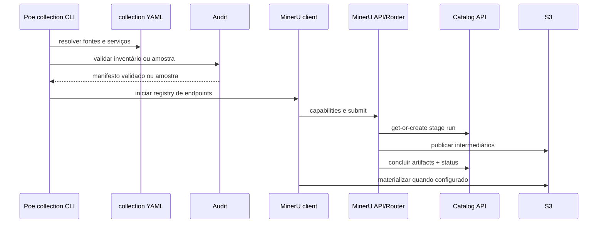

# Estrutura do repositório

[Documentação](../README.md) · [Uso](../operational/README.md) ·
[Local](../operational/local/README.md) ·
[Dev catalogado](../operational/cataloged-development/README.md) ·
[Produção](../operational/production/README.md) ·
[Documentação técnica](README.md)

Este documento é o mapa de orientação para desenvolver o framework. Ele
distingue código de produto, infraestrutura, dados operacionais, experimentos
e documentação.

## Árvore principal

```text
baseia_v3/
├── src/baseia_extract/       código Python do framework
├── infra/                    imagens e entrypoints dos serviços
├── docs/                     documentação operacional e técnica
├── data/                     snapshot/import source legado e dados ignorados
├── parsers/                  área para experimentos de parsing
├── notebooks/                exploração interativa
├── quality/                  referências e diagnósticos de qualidade
├── scripts/                  operações especializadas e migrações auxiliares
├── tests/                    testes que agregam comportamento
├── artifacts/                artefatos auxiliares do projeto
├── referencias/              referências técnicas fora do corpus
├── compose.yaml              topologia local de serviços
├── pyproject.toml            dependências, build e tasks Poe
├── alembic.ini               configuração de migrations
├── .env.example              configuração operacional documentada
├── README.md                 portal do projeto
├── SOUL.md                   fonte de intenção do produto
└── AGENTS.md                 regras específicas para agentes
```

## Pacote principal

```text
src/baseia_extract/
├── collection.py
├── collection_worker.py
├── inventory.py
├── audit.py
├── layout.py
├── identity.py
├── schemas.py
├── settings.py
├── tasks.py
├── extract_control.py
├── mineru.py
├── recover.py
├── document_manifest.py
├── storage.py
├── bootstrap.py
├── bootstrap_s3.py
├── render.py
├── content_list.py
├── bibliographic.py
├── review.py
├── ingest_models.py
├── chunking.py
├── ingest.py
├── render_publish.py
├── semantic_models.py
├── structure.py
├── reporting.py
├── ir/
│   ├── models.py
│   ├── builder.py
│   └── validate.py
└── catalog/
    ├── models.py
    ├── contracts.py
    ├── service.py
    ├── api.py
    ├── database.py
    └── run.py
```

## Responsabilidades dos módulos

| Módulo | Responsabilidade |
| --- | --- |
| `collection.py` | schema YAML, registro global, fontes externas, contexto e CLI |
| `collection_worker.py` | executa e audita os checkpoints de uma coleção isolada |
| `settings.py` | resolve paths e configuração do cliente local |
| `layout.py` | calcula o PDF canônico, diretório irmão e subdiretórios |
| `identity.py` | IDs determinísticos e chaves lógicas |
| `schemas.py` | schemas locais de inventário e extração |
| `inventory.py` | inspeção de PDFs, hashes e amostragem |
| `audit.py` | valida inventário, extração, render e manifests |
| `tasks.py` | entry point da task de extração e composição do cliente |
| `extract_control.py` | ações start/add/scale/status/watch/stop |
| `mineru.py` | cliente HTTP, registry de endpoints, reconciliação e materialização |
| `recover.py` | recuperação de resultados persistidos sem reenvio |
| `document_manifest.py` | manifest v2 por documento |
| `storage.py` | artifact store S3 com SDK oficial |
| `bootstrap.py` | consolidação específica da coleção inicial |
| `bootstrap_s3.py` | publicação, verificação e ativação de snapshots arbitrários |
| `ir/` | construção e validação da representação intermediária |
| `structure.py` | inferência de estrutura documental |
| `semantic_models.py` | modelos do conteúdo semântico renderizado |
| `render.py` | geração local dos cinco artefatos canônicos |
| `content_list.py` | reconcilia a evidência `content_list_v2` com blocos do IR |
| `bibliographic.py` | deriva metadados bibliográficos e flags de revisão |
| `review.py` | consulta read-only das revisões pendentes em `metadata.json` |
| `ingest_models.py` | schema e validação da política YAML de ingestão |
| `chunking.py` | projeção hierárquica do IR/estrutura em chunks determinísticos |
| `ingest.py` | preparo local e aplicação OpenRouter/Qdrant idempotente |
| `render_publish.py` | publicação S3 e conclusão catalogada do render |
| `reporting.py` | eventos, progresso e relatórios operacionais |
| `catalog/models.py` | modelo relacional SQLAlchemy |
| `catalog/contracts.py` | contratos HTTP Pydantic |
| `catalog/service.py` | transações, locks, leases e idempotência |
| `catalog/api.py` | endpoints FastAPI |
| `catalog/database.py` | engine e sessões PostgreSQL |
| `catalog/run.py` | startup da Catalog API no host |

## Infraestrutura

```text
infra/
├── catalog/
│   ├── Dockerfile
│   ├── start.sh
│   └── migrations/
└── mineru/
    ├── Dockerfile
    ├── start.sh
    ├── router_with_persistence.py
    ├── persistent_results.py
    ├── catalog_client.py
    ├── s3_results.py
    └── sitecustomize.py
```

`infra/catalog` empacota o mesmo pacote Python e aplica Alembic antes de
iniciar Uvicorn.

`infra/mineru` deriva da imagem oficial PyTorch com CUDA/cuDNN, fixa uma versão
MinerU e instala o patch delimitado de persistência. O router oficial roda no
mesmo container e distribui trabalho às GPUs locais.

## Coleção fora do repositório

Novas coleções não são copiadas para o worktree:

```text
D:/colecoes/exemplo/
├── baseia.collection.yaml
├── .baseia/
│   ├── inventory/
│   ├── audit/
│   ├── extraction/
│   ├── pipeline/
│   └── bootstrap/s3/
├── documento.pdf
└── documento/
    ├── manifest.json
    ├── intermediate/
    └── canonical/
```

`collection.py` usa `platformdirs` para manter um registro global contendo
somente coleção atual e paths para os YAMLs. `BASEIA_COLLECTIONS_DIR`
sobrescreve esse local. Cada execução abre um subprocesso com
`BASEIA_DATA_DIR`, fontes e serviços do contexto, evitando que estado de
coleções concorrentes se misture.

O YAML pode apontar para várias fontes físicas e prefixos lógicos. Ele grava
URLs e nomes de variáveis de credencial, nunca os segredos.

## Dados locais legados

```text
data/
├── documents/       PDFs, diretórios irmãos, intermediários e canônicos
├── inventory/       inventory.csv e sample.csv
├── audit/           diagnósticos reproduzíveis
├── extraction/      estado operacional do cliente MinerU
├── bootstrap/       plano, journal, locks e quarentenas
└── render_summary.json
```

`data/documents` é a fonte de migração/consolidação legada deste repositório.
Não é o destino de `poe init`, `poe sample` ou `poe quick` para novas
coleções. Em produção, o snapshot S3 ativo e o catálogo são o registro
publicado.

## Entry points e tasks

| Task | Entry point |
| --- | --- |
| `collection` / `init` / `pipeline` / `quick` | `baseia_extract.collection` |
| worker isolado | `baseia_extract.collection_worker` |
| `inventory` / `sample` | `baseia_extract.inventory` |
| `audit` | `baseia_extract.audit` |
| `extract` | `baseia_extract.tasks` → `extract_control` → `mineru` |
| `recover-extract` | `baseia_extract.recover` |
| `render` | `baseia_extract.render` |
| `review` | `baseia_extract.review` |
| `ingest` | `baseia_extract.ingest` |
| `bootstrap` | `baseia_extract.bootstrap` |
| `promote-s3` | `baseia_extract.bootstrap_s3` |
| `catalog-api` | `baseia_extract.catalog.run` |
| `catalog-migrate` | Alembic |

As declarações executáveis ficam em `pyproject.toml`; a
[referência operacional](../operational/reference/commands.md) deve refletir
essas assinaturas somente quando sua atualização tiver sido solicitada.

## Fluxo de uma extração



## Onde implementar uma mudança

| Necessidade | Ponto inicial |
| --- | --- |
| contexto ou ciclo de vida de coleção | `collection.py` e `collection_worker.py` |
| novo campo de inventário | `inventory.py`, schemas e auditoria |
| mudança de identidade | `identity.py` e contratos do catálogo |
| novo artifact canônico | `render.py`, manifest e publicação |
| endpoint de catálogo | `catalog/contracts.py`, `service.py` e `api.py` |
| persistência MinerU | adapters em `infra/mineru`, preservando o patch mínimo |
| nova task | `pyproject.toml` e entry point no pacote |
| nova configuração | código consumidor e `.env.example` |
| dívida ou necessidade sem solução definida | [soft backlog](backlog/README.md) |

Anterior: [Índice técnico](README.md)
Próximo: [Visão geral da arquitetura](architecture/overview.md)
Operação relacionada: [Referência de comandos](../operational/reference/commands.md)
