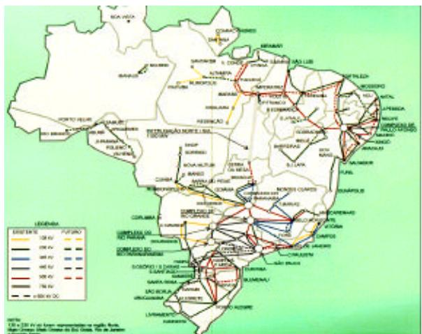
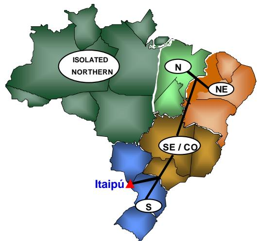
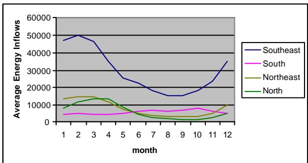
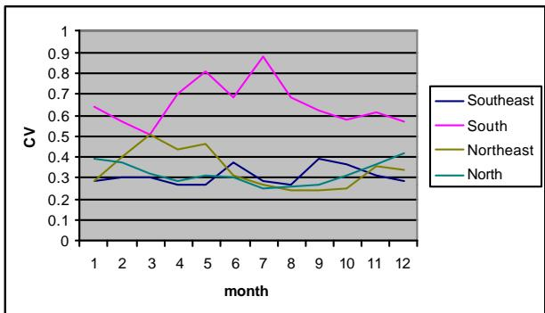
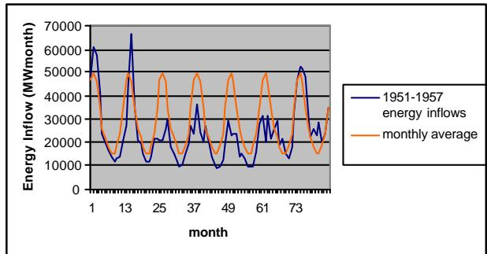
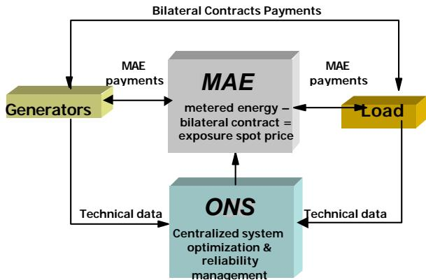
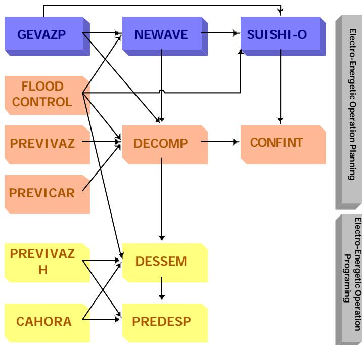

# Chain of Optimization Models for Setting the Energy Dispatch and Spot Price in the Brazilian System

M.E.P.Maceira CEPEL, UERJ

L.A.Terry CEPEL

F.S.Costa CEPEL, UERJ

J.M.Damázio UERJ

A.C.G.MeloCEPEL, UERJ

CEPEL, Electric Power Research Center UERJ, State University of Rio de Janeiro Rio de Janeiro, Brazil

Abstract – This work describes the main features of the computational system for the electric-energetic operation planning and programming of the Brazilian energetic system. A chain of optimization models with different planning horizons and degrees of detail in system representation compose it. This computational system was proposed to the Brazilian Independent System Operator (ONS) and currently is being gradually implemented. ONS is responsible for central system optimization and dispatch according to clearly defined rules agreed by all industry members and approved by the Regulatory Body (ANEEL). The optimization models also calculate the water values that will form the basis for determining the Wholesale Energy Market (MAE) spot price.

Keywords: Hydrothermal systems, optimisation model, simulation model, operation planning, operation programming

## 1 - INTRODUCTION

Brazil has a population of 160 million inhabitants, a land area slightly smaller than the United States, and economic output of nearly US\$ 800 billion, half of Latin America economic output. The industry output is responsible for 37% of the GDP, indicating its maturity level. Brazilian economy is integrated in a regional trade zone (MERCOSUL) with Argentina, Uruguay and Paraguay which objective is to increase the competitiveness of the regional economies.

The Brazilian power system is composed of two large interconnected systems. The first one corresponds to the South, Southeast and Central-West Regions (SSE), responsible for 79% of the consumption, and the second one, to the Northeast and part of the North Region (NNE), responsible for 19% of the consumption. Since December 1998, a 500 kV, 1,000 MW, 1,000 km is interconnecting these two systems. There is also an isolated system in the Northern Region, responsible for the remaining 2% of consumption. Figures 1 and 2 illustrate the Brazilian main transmission grid and the subsystems.

This work describes the main features of the computational system for the electric-energetic operation planning and programming of the Brazilian system. A chain of optimization models with different planning horizons and degrees of detail in system representation compose this computational system. It was proposed to the Brazilian Independent System Operator (ONS) and currently is being gradually implemented. ONS is responsible for central system optimization and dispatch according to clearly defined rules agreed by all industry members and approved by the Regulatory Body (ANEEL). The optimization models also compute the water values that form the basis for determining the Wholesale Energy Market (MAE) spot price.

  
Figure 1 – Brazilian Main Transmission Grid

  
Figure 2 – Brazilian Subsystems

## 2 - CHARACTERISTICS OF THE BRAZILIAN SYSTEM

The Brazilian system is hydro dominated (more than 90% of the installed capacity) and characterized by large reservoirs presenting multi-year regulation capability, arranged in complex cascades over several river basins. It is a large-scale system presenting 84 hydro plants and 28 thermal plants (2 of them are nuclear), totaling more than 200 units. There are also isolated electric systems of varying sizes, mostly located in the North region. The hydro plants use store water in the reservoirs to produce energy in the future, replacing fuel costs from the thermal units. However, the future water inflows have a stochastic behavior that is dependent on future rainfall, which cannot be accurately predicted. Moreover, the amount of inflows varies greatly in different seasons, as can be seen in Figure 3, and even from year to year. This can be explained by the high coefficient of variation of the monthly inflows, as shown in Figure 4. Another characteristic is that the historical inflow records present very dry periods, some greater than one year, as can be shown in Figure 5.

  
Figure 3 – Monthly Average Energy Infows

  
Figure 4 – Monthly Energy Infows Coefficient of Variation

The limited reservoir volumes plus the variability of future inflows produce a link between an operating decision in a given stage and the future consequences of the decision. For example, if the operation decision is to deplete the stocks of hydroelectric energy, and low inflows volumes occur, the hydroelectric plants may not have enough water to supply the demand in the future. As a consequence, it may be necessary to use very expensive thermal generation in the future, or even fail to supply the load. On the other hand, if the reservoir levels are kept high through a more intensive use of thermal generation at higher costs, and high inflow volumes occur, the reservoir capacities may be exceeded and there will be spillage in the system, which means a waste of energy.

In summary, the Brazilian hydrothermal operation problem has the following characteristics:

• It is coupled in time as an operation decision today affects future operation costs;

• It is essentially stochastic, due to the uncertainty about future inflows;

• The inflow historical records present multi-year dry periods;

• The reservoirs present multi-year regulation capability;

• The water released from one hydro plant affects the other plants downstream;

The worth of energy generated in a hydro plant cannot be measured directly as a function of the plant state alone, but rather in terms of fuel cost savings from avoided thermal generation;

• There is a trade-off between operation cost and supply reliability.

Besides all these characteristics, the daily dispatch programming should take into account the thermal and hydro unit commitment. As a consequence, the operations scheduling ranges from multi-year reservoir optimization to hourly dispatch.

  
Figure 5 – A Dry Period in The Southeast System

Load growth rates in Brazil have been historically high, mostly due to the country's industrialization effort. In the 1970s, average growth rates were 9%. Even with the economic recession of the late 1980s and early 1990s, growth rates averaged 4%. In 1997, firm load increase was around 6%. Forecasts made by CCPE (Coordinating Committee for System Expansion Planning) indicate an average growth around 5.1%, for the next ten years.

Hydropower is expected to remain the dominant source of electrical power because of the country’s high load growth rates and the availability of a great hydro potential to be exploited. Nevertheless the participation of thermal plants in the system is expected to increase in view of the advances in gas turbine technology and because the exploitation of economic hydro sites follows a crescent cost behavior.

## 3 - THE BRAZILIAN RESTRUCTURING PROCESS

In the new trading model for the Brazilian electricity sector there is a Wholesale Energy Market (MAE – Mercado Atacadista de Energia), where all buyers and sellers of electricity can trade and where the spot price of energy will be determined. The MAE was created by a multilateral agreement which is compulsory for all generators with installed capacity greater 50 MW and for all distribution and retail companies with consumption grater than 100 GWh per annum. Large consumers with demand above the threshold for the free market (currently 10MW) can choose to become MAE members.

The main objectives of the MAE are [1]:

• to set a price which reflects, in each time period, the marginal cost of energy on the system. This price will support the long term bilateral contracts;

• to provide a marketplace in which generators and retailers can trade their uncontracted energy;

• to create a multilateral environment to support the development of competition under which a retailer may buy from any generator and a generator may sell to any retailer.

In such environment, there will be competition in the generation and trading segments, while the transmission and distribution segments will remain as natural monopolies, subject to regulated tariffs. The competition among the generation companies will be associated to the establishment of bilateral long-term contracts with the loads. The bilateral contracts are financial instruments, which specify a contract price for a fixed volume of energy. In other words, the generators receive a negotiated payment from loads and, in exchange, become responsible for their spot tariffs. These bilateral contracts reduce the exposure to the spot prices.

The trading arrangements are based around a tight, centralized system optimization, scheduling and dispatch scheme. In this approach hydro and thermal generators submit basically technical data on their plant, such as water levels in the reservoirs, rate of inflow, technical availability of the turbines, thermal efficiency, fuel and operating cost data, etc. Thermal plants are allowed to bid operational prices in a narrow range.

Based on the received technical data, the ONS establishes a generation schedule which describes which generation plants should be dispatched and the associated generation target in order to achieve least cost operation of the whole system. This schedule is obtained through a chain of optimization models that also calculates the water values. The water values form the basis for determining the MAE price in each period. Figure 6 illustrates the relationship between ONS, MAE, generators and load.

Generators and retailers will continue to trade most of their energy via bilateral contracts. These contracts will originate payments from retailers to generators. The price and volume of energy specified in the bilateral contracts will determine the size of such payments.

After deduction of the sales and purchases covered by bilateral contracts, the net requirements of generators and retailers will be traded in the MAE thus being subject to the MAE price.

  
Figure 6 – ONS, MAE, Generators and Load

It is important to observe that all energy flows will be taken into account in determining the optimal generation schedule, dispatch and the MAE price. However, only the uncontracted energy flows would be subject to the MAE price.

To determine the MAE price, only the major transmission constraints will be taken into account. Therefore, the Brazilian interconnected system will be divided into a small number of regions (currently four), denoted as “submarkets” or “subsystems”, which will reflect the effects of these more important transmission limitations. The MAE price will be determined for each submarket and transmission loss allocation factors will be used to calculate the final price for each generator and load inside each submarket.

Generators and loads will also pay a yearly fixed transmission use of the system charge (\$/installed kW for generators and \$/yearly peak for loads), which depends on their location. This tariff does not depend on bilateral contracts, i.e., there are no wheeling rates.

## 4 - THE OPERATION PLANNING MODELS

Mathematical algorithms compose the core of the Energy Operation Programming/Planning Support System -SAPPE system. Figure 7 illustrates the chain of models with different planning horizons and degrees of detail in system representation, proposed to the Brazilian system. The operations scheduling ranges from long term multi-year reservoir optimization to short term hourly dispatch. Stochastic dual dynamic programming algorithms are applied to determine the optimal allocation of hydro and thermal resources in the long and mid-term operation planning. In turn, for the short term operation programming a dual dynamic programming coupled to Lagrangian decomposition scheme is applied.

The objective of the operation planning of a hydrothermal system is to calculate an operation strategy which, for each stage of the planning period, given the system state at the beginning of the stage, produces generation targets for each plant. The state system should include the reservoir storage level and information about “hydrologic trend”, for example, the last p inflow volumes. Long term operation planning uses energy storage in the aggregated reservoir and the previous energy inflows of each subsystem. The mid term operation planning and the short term operation programming use the storage and the previous inflows for each hydro plant. The strategy minimizes the expected value of the operation cost during the period, which is composed of fuel costs plus penalties for failure in load supply. If the inflow volumes are known at the beginning of each stage, stochastic dual dynamic programming, represented by the following recursive equation can solve the operation dispatch problem:

$$
\alpha _ { \mathrm { t } } ( \mathrm { X } _ { \mathrm { t } } ) = \operatorname { E } _ { \mathrm { A } _ { \mathrm { t } } | \mathrm { X } _ { \mathrm { t } } } \left( \operatorname* { m i n } \sum _ { \mathrm { t h e r m a l } \mathrm { p l a n t s } } \mathrm { C } _ { \mathrm { t } } \mathrm { G T } _ { \mathrm { t } } + \frac { 1 } { \beta } \alpha _ { \mathrm { t } + 1 } ( \mathrm { X } _ { \mathrm { t } + 1 } ) \right)
$$

$$
\forall \ : \mathrm { t } = \mathrm { T } , \ : \mathrm { T } { - } 1 , . . . , 1
$$

subject to

Storage balance equation in each hydro plant or subsystem aggregated reservoir

$$
\begin{array} { r } { \mathbf { V } _ { \mathrm { t + 1 } } = \mathbf { V } _ { \mathrm { t } } + \mathbf { A } _ { \mathrm { t } } - \mathbf { Q } _ { \mathrm { t } } - \mathbf { S } _ { \mathrm { t } } + \displaystyle \sum _ { \mathrm { i m e d i a t l y } } ( \mathbf { Q } _ { \mathrm { t } } + \mathbf { S } _ { \mathrm { t } } ) - \mathbf { E } \mathbf { V } _ { \mathrm { t } } } \\ { \mathbf { u p s t r e a m } } \\ { \mathbf { h y d r o p l a n t s } } \end{array}
$$

Demand supply equation in each subsystem k

$$
\sum _ { \mathrm { h y d r o } } \mathsf { p } \mathbf { Q } _ { \mathrm { t } } + \sum _ { \mathrm { { t h e r m a l } } } \mathbf { \bar { G } } \mathbf { T } _ { \mathrm { t } } + \sum _ { \mathrm { { s u b s y s t e m s } } } ( \mathbf { F } _ { \mathrm { t } , 1 , \mathrm { k } } - \mathbf { F } _ { \mathrm { t } , \mathrm { k } , 1 } ) = \mathbf { D } _ { \mathrm { t } }
$$

Bounds in storage in each hydro plant or subsystem aggregated reservoir

$$
\mathrm { \Delta V } _ { \mathrm { t + 1 } } \leq \overline { { \mathrm { V } } }
$$

Maximum turbined outflow in each hydro plant or subsystem aggregated reservoir

$$
\mathrm { Q } _ { \mathrm { t } } \leq \overline { { \mathrm { Q } } }
$$

Lower bounds on total outflow in each hydro plant or subsystem aggregated reservoir

$$
{ \sf Q } _ { \mathrm { t } } + { \sf S } _ { \mathrm { t } } \geq { \sf Q } _ { \mathrm { m i n } }
$$

Maximum generation in each thermal plant $\mathbf { G } \mathbf { T } _ { \mathrm { ~ t ~ } } { \le } \mathbf { G } \mathbf { T }$ max t

Flow limits among subsystems

F min $\mathbf { \Phi } _ { \mathrm { t } } \leq \mathrm { F } _ { \mathrm { t } } \leq \mathrm { F } \operatorname* { m a x } _ { \mathbf { \Phi } _ { 1 } }$

Set of multivariate linear constraints representing the cost-to-go function

$$
\alpha _ { \mathrm { t + 1 } } \geq \sum _ { \mathrm { h y d r o } } \pi _ { \mathrm { v , t + 1 } } \mathrm { V _ { t + 1 } } + \pi _ { \mathrm { a l , t + 1 } } \mathrm { A _ { t } } + \cdots + \pi _ { \mathrm { a p , t + 1 } } \mathrm { A _ { t - p + 1 } } + \mathrm { c o n s t }
$$

where

t indexes the stages

$\mathrm { X } _ { \mathrm { t } }$ state vector at the beginning of stage $\mathrm { t } \ ( \mathrm { V } _ { \mathrm { t } } , \mathrm { A } _ { \mathrm { t } }$ $\mathbf { \Lambda } _ { 1 } , . . . , \mathbf { A } _ { \mathrm { t - p } } )$

$\mathrm { V _ { t } }$ reservoir storage level

$\mathbf { A } _ { \mathrm { t } }$ inflow volumes to hydro plant or energy inflow to subsystems

$\alpha _ { \mathrm { t } } ( \mathrm { X } _ { \mathrm { t } } )$ expected value of the operation cost from stage t to the end of the planning period under the optimal operation policy

$\mathbf { A } _ { \mathrm { t } } | \mathbf { X } _ { \mathrm { t } }$ represents the probability distribution of inflows $\mathbf { A } _ { \mathrm { t } }$ conditioned by the state $\mathrm { X } _ { \mathrm { t } }$

$\operatorname { E } ( . )$ expected value

$\mathrm { G T _ { t } }$ thermal generation of each thermal plant

$\mathrm { Q } _ { \mathrm { t } }$ turbined outflow volume in each hydro plant or aggregated hydro production in each subsystem

  
Figure 7 - Chain of Models for the Brazilian Operation Planning - SAPPE system

β discount rate

$\mathrm { C _ { t } }$ generation cost of each thermal plant $\mathbf { S _ { t } }$ spilled volume in each hydro plant or aggregated energy spillage in each subsystem $\mathrm { E V _ { t } }$ evaporation volume on reservoirs or evaporated energy on aggregated reservoirs

$\rho$ production coefficient; it is a function of the initial volume, end volume and outflow $( \mathrm { V _ { t } } ,$ $\mathbf { V } _ { \mathrm { t } + 1 } , \mathbf { Q } _ { \mathrm { t } } , \mathbf { S } _ { \mathrm { t } } )$

$\mathrm { F _ { t , k , l } }$ energy flow from subsystem k to subsystem l $\mathrm { D } _ { \mathrm { t } }$ energy demand

$\overline { { \mathrm { V } } }$ maximum reservoir storage

$\overline { { \mathbf { Q } } }$ maximum turbined outflow volume or aggregated hydro production

Qmin minimum turbined outflow volume or aggregated hydro production

GTmaxmaximum thermal generation

Fmin maximum flow between subsystems

Fmax minimum flow between subsystems

$\pi _ { \mathrm { v } }$ simplex multiplier or dual variable associated to reservoir storage level

$\pi _ { \mathrm { a l } }$ simplex multiplier or dual variable associated to inflow volume in the previous stage

Newave model [2] was developed for the long run operation planning. It computes, for every month of the five to ten years of the planning period, the optimum allocation of hydro and thermal resources, that minimizes the expected total operation cost (thermal generation costs plus penalties for failure in load supply). The several reservoirs are aggregated in energy equivalent reservoirs representing the south, southeast, north and northeast subsystems of Brazil. The solution approach is obtained by stochastic dual dynamic programming. In this algorithm the stored energy and the hydrological trend represent a state, and a Monte Carlo simulation scheme is used to interactively construct a multivariate expected cost to go function for the system.

Newave model presents four basic modules: Energy Equivalent Reservoir (for each subsystem, reservoirs are aggregated into one energy equivalent reservoir and streamflows are aggregated into equivalent energy inflows), Energy Inflows (stochastic modeling of energy inflows by using periodic auto-regressive models – PAR(p)), Hydrothermal Operation Strategy (determines the most economical operation strategy to the subsystems, taking into account uncertainties on future inflows and load levels), and Simulation of System Operation (by using synthetic inflows scenarios, computes system performance probabilistic indices such as deficit risks, expected energy not supplied, expected energy interchanges among subsystems and expected marginal costs as well as their empirical probability distributions).

Gevazp model [3,4] is a multivariate monthly inflow generator model for Newave, Decomp and Suishi-o models. It chooses a stochastic time series PAR(p) model that ensures resemblance between the historical and the synthetic inflow sequences and is able to produce droughts as severe as those observed in the historical records. In this model the inflow at period (t) is a function of the previous inflows (t-1), (t-2), ... (t-p), and the time dependence structure is seasonal.

Let $Z _ { \mathrm { t } } , ~ \mathrm { t } = 1 , ~ 2 , ~ . . . ,$ be a seasonal time series with period s. The time index t may be regarded as a function of the year T $( \mathrm { T } = 1 , . . . , \mathrm { N } )$ , and the season m $( \mathrm { m } = 1 , . . . ,$ $\mathbf { s } ) \colon \mathbf { t } = \left( \mathbf { T } - 1 \right) \mathbf { s } + \mathbf { m }$ . The periodic auto-regressive model, denoted by $\mathsf { P A R } ( \mathsf { p } _ { 1 } , . . . , \mathsf { p } _ { \mathrm { s } } )$ , can be written as:

$$
\phi ^ { \mathrm { m } } ( \mathrm { B } ) \left( \frac { Z _ { \mathrm { t } } - \mu _ { \mathrm { m } } } { \sigma _ { \mathrm { m } } } \right) = \mathrm { a _ { t } }
$$

where $\phi ^ { \mathrm { m } } ( \mathbf { B } ) { = } 1 { - } \phi _ { 1 } ^ { \mathrm { m } } \mathbf { B } { - } \ldots { - } \phi _ { \mathrm { p _ { m } } } ^ { \mathrm { m } } \mathbf { B } ^ { \mathrm { p _ { m } } }$ ; B is the backward shift operator on t; $\mu _ { \mathrm { m } }$ is the mean period m; and $\mathbf { a } _ { \mathrm { t } }$ is the time uncorrelated series which is independent of $Z _ { \mathrm { t } } ,$ and it has also zero mean and variance equal to $\sigma _ { \mathrm { a } } ^ { 2 ( \mathrm { m } ) }$

One convenient and efficient estimation technique for PAR models is to formulate de Yule-Walker equations and solve them to obtain estimates of the model parameters. The order of the AR model fit to each season $\left( \mathtt { p } _ { \mathtt { m } } \right)$ may be determined by examining plots of the partial auto-correlation function (PACF) for each season. $\boldsymbol { \mathrm { p } } _ { \mathrm { m } }$ may vary from season to season but all of the parameters are estimated.

Suishi-o model [5] is a detailed simulation model of power plants operation for interconnected hydrothermal systems. It is able to simulate electrically interconnected hydrothermal systems in networks but provided they are hydraulically disconnected. It may be coupled to the strategic decision model, Newave, by the expected system cost to go function for each stage, and it can consider operation constraints for multiple water usage: maximum flow for flood control, minimum flow for sanitation or navigation and river flow diversion for irrigation projects. It simulates multivariate streamflows sequences: observed in the past or generated by Gevazp model, producing probabilistic indices for system performance. This model can calculate the firm energy or the assured energy within a pre-established energy deficit probability. Special river basins operation can also be represented.

These models complete the long run operation planning.

Decomp model [6] determines the generation schedule for each system plant (hydro and thermal) such that: supply the load and minimize expected operating cost for every week of the first month and for the next months of the planning period taking into account the long term stochastic behavior of inflows. The solution approach is obtained by stochastic dual dynamic programming, with the storage volume of the reservoirs as the state variables. The other main features are: individualized representation of hydro plants, integration with long/short term models (Newave/Dessem) via expected cost to go functions, non-linear head variation of hydro plants, water travel, load levels and general linear constraints on generation targets. The unique water inflow scenario used in the four/five weeks of the first month is obtained by a inflow forecast model, Previvaz, and the range of monthly inflows of the next months are generated by Gevazp model.

Previvaz [7] is a stochastic model that produces weekly streamflow forecasts until six weeks ahead to be used in mid-term Planning Operation (Decomp model). The model automatically analyzes the historical weekly inflow series for each hydroplant and chooses for each week the best stochastic model based on the forecast mean squared error. In this analysis, Previvaz model consider 93 distinct modeling strategies based on linear ARMA(p,q) family, considering both periodic and nonperiodic models , different estimation methods and series transformation.

Flood Control model [8], actually named SPEC System (System for Flood Prevention Studies), builds flood control rule curves for multipurpose multireservoir systems located in hydrographics basins with strong seasonality and incorporates facilities to consider the El Niño-South Oscillation phenomena (ENSO). The methodology of SPEC system is based on a stochastic formulation as flood prevention studies is done before the rainy season, when inflows are unknown.

The SPEC system is formed by a set of models, each one having a specific function. The first is one a stochastic models to generate daily inflow series named DIANA model, the second is ENSOCLAS which permits to consider the ENSO in the synthetic inflow generation. The third one, CAEV, is based on the controllability conditions (necessary and sufficient conditions for flood control) and builds flood control rule curves for equivalent reservoirs (partial systems or a set of reservoirs). The last one, VESPOT desegregates the flood control rule curves for equivalents reservoirs, calculated by CAEV, in individualized flood control rules curves for each reservoir in the system. These reservoir empty volumes go to Newave, Suishi-o, Decomp and Dessem models.

Confint model [9] is responsible by the reliability evaluation of hydrothermal interconnected systems. The system is represented by a linear network flow model, where the nodes are the areas or subsystems, and the arcs are the area generations and loads and interconnection capacities. The arcs are treated as random variables. The reliability indices (loss of load probability – LOLP, expected energy not supplied – EENS, loss of load frequency – LOLF and loss of load duration – LOLD) are calculated through a direct integration algorithm or by Monte Carlo simulation. The Confint program also produces area power marginal costs as well as sensitivity indices with respect to reinforcements on interconnections and generation capacity.

Previcar model [10] produces weakly or monthly load forecast until twelve months ahead. The forecasts are based on time series and neural network models.

These models complete the mid run operation planning.

Dessem model [11] was developed for the daily dispatch programming. It computes a generation dispatch for each half an hour of the next week taking into account detailed hydraulics constraints. Also, a D.C. power flow model represents the transmission network. In each period the program minimizes the sum of thermal generation and the future cost associated to hydro decisions. It applies dual dynamic programming to the multi-stage problem and provides marginal costs for each network bus. The hydraulic constraints represented in the model are: water balance in the reservoirs, flow routing representation, channel and reservoir levels bounds (navigation, intakes), maximum channel discharge and reservoir outflow, channel and reservoir levels ramp constraints (bank scour protection, harbor protection), minimum channel discharge (water quality, ecological requirements, irrigation / industrial / residential supply), AGC (automatic generation control), unit commitment of thermal units, efficiency curves and prohibited zones in turbines.

Predesp model [11] computes a generation dispatch for each half an hour of the next day taking into account water balance constraints and the constraints associated to the A.C. network flow representation. In each period the program minimizes the sum of thermal generation and the future cost associated to hydro decisions, provides marginal costs for each network bus. As results, it produces the hydraulic operation point (turbined volumes, spilled volumes and stored volumes for hydro plants), the electric operation point (bus voltages, power plant active and reactive figures, circuit flows, etc.).

Previvazh [12] is a stochastic model that produces daily streamflow forecasts until fourteen days ahead to be used in Daily Programming (Dessem model). The methodology of daily forecasts is based on the desegregation of the weekly streamflow forecasts produced by Previvaz model. The desegregation process uses the synthetic daily inflow sequences that are generated conditioned to the value of the last two observed inflows. This model preserves the temporal dependence of the weekly streamflow forecasts used in the Mid Term Operation Planning and it takes into account the natural characteristics of the daily inflow process, as the high skewness, the strong seasonallity, and the special behavior of the daily hydrograph. Furthermore, it is less complex than the Rainfall-Runoff models, as the number of parameters is more parsimonious.

SISCV (Rainfall-Runoff Forecast System) [13] is a system based on two deterministic rainfall-runoff models, IPH II [14] and SMAP II [15], and as Previvazh, produces daily streamflow forecasts to be used in Daily Programming (Dessem model). The SMAP II model has a simple structure based on three reservoirs that represents the superficial zone, the subsuperficial zone and the deep zone. The model uses the Soil Conservation Service equation to separate the superficial runoff. The mathematics equations are based on one state variable that corresponds to the reservoir level at each time interval and a set of parameters associated to the physical characteristics of the hydrographic basin. The IPH II model is part of a set models developed by IPH/UFRGS [14] for simulating rainfall-runoff. It is based on a set of equations as the water balance, Horton infiltration and an empirical function for percolation.

Cahora model [16] is responsible for the hourly load forecast. It applies time series, fuzzy sets and neural network models.

These models complete the short operation programming.

## 5 - CONCLUSIONS

This work described the main features of the computational system for the electric-energetic operation planning and programming of the Brazilian energetic system. A chain of optimization models with different planning horizons and degrees of detail in system representation compose it. This computational system was proposed to the Brazilian Independent System Operator (ONS) and currently is being gradually implemented. The optimization models also compute the water values that will form the basis for determining the Wholesale Energy Market (MAE) spot price.

## ACKOWLEDGEMENTS

The authors would like to thank the contributions of the following people to the development of this work: A.L.Marcato, A.L.Diniz, V.S.Duarte, D.L.Jardim, L.C.F.Souza, L.N.R.Xavier, M.Luna, C.Sagastizabal, C.Prata, E.Castronuovo, J.F.Peçanha, P.M.Lourenço, V.Navarro, G.F.Ribeiro, S.Binato, S.P.Romero, A.Belloni, R.Castro, J.Kelman, J.P.Costa, S.Prado, A.S.Kligerman, C.Suanno, C.Mércio, A.O.Girardhi, A.Livino, R.Vieira, L.P.Silva, A.E.Xavier, M.V.F.Pereira, S.H.F.Cunha, G.C.Oliveira, S.Granville.

## REFERENCES

[1] COOPERS & LYBRAND, “Brazil Electricity Sector Restructuring Study: Draft Report IV-I”, MME/SEN/ELETROBRÁS Project Report, Rio de Janeiro, June 1997.

[2] M.E.P.Maceira, C.B.Mercio, B.G.Gorenstin, S.H.F.Cunha, C.Suanno, M.C.Sacramento, A.S.Kligerman, Energy Evaluation of The North/Northeastern and South/Southeastern Interconnection with NEWAVE Model, VI Symposium of Specialists in Electric Operational and Expansion Planning - SEPOPE, Salvador, Brazil, May 1998.

[3] M.E.P.Maceira, C.V.Bezerra, Stochastic Streamflow Model for Hydroelectric Systems, 5th International

Conference on Probabilistic Methods Applied to Power Systems - PMAPS, Vancouver, Canada, September 1997.

[4] D.L.Jardim, M.E.P.Maceira, D.Falcão, Stochastic Streamflow Model for Hydroelectric Systems using Clustering Techniques, International Conference on Electric Power Engineering – PowerTech, Porto, Portugal, September 2001.

[5] M.E.P.Maceira, S.H.F.Cunha, Simulating the Energy Generation of Interconnect Hydro-thermal Systems - SUISHI Model, XIII Brazilian National Seminar on Electrical Power Production and Transmission -SNPTEE, Camboriú, Brazil, October 1995.

[6] S.H.F.Cunha, J.P.Costa, S.Prado, C.L.C. de Sá Jr., Medium Term Hydro-thermal System Optimization Under a Wholesale Energy Market, VI Symposium of Specialists in Electric Operational and Expansion Planning - SEPOPE, Salvador, Brazil, May 1998.

[7] M.E.P.Maceira, J.M.Damázio, A.O.Ghirardi, H.M.Dantas, Periodic ARMA Models Applied to Weekly Streamflow Forecasts, International Conference on Electric Power Engineering – PowerTech, Budapest, Hungary, September 1999.

[8] J.M.Damázio, F.S.Costa, Building Flood Control Rule Curves for Multipurpose Multireservoir System Using Controlability Condition, Water Resourses Research, Vol30, n04, pp1135,1144, April 1994.

[9] A.C.G.Melo, R.V.Lício, J.L.Araújo, M.V.F.Pereira, An Analytical Approach to Calculate Exact Sensitivities of Multi-Area Reliability Indices with Respect to Variations of Equipment Failure and Repair Rates, Invited Paper, IEEE Electric Power and Energy Systems, January 1998.

[10] P.M .Lourenço, C.R.S.H.Lourenço, G.F.Ribeiro, V.Navarro, Short Term Load Forecasting Using Fuzzy Logic and Calendar of Events, 19th International Symposium on Forecasting, Washington DC, June 1999.

[11] M.E.P.Maceira, L.A.Terry, A.S.L.Diniz, L.C.F. de Souza, F.S.Costa, S.P.Romero, S.Binato, S.M.Amado, C.E.Vilasboas, R.Vilanova, Hourly Generation Dispatch Representing Detailed Hydraulic Constraints, VII Symposium of Specialists in Electric Operational and Expansion Planning-SEPOPE, Brazil, May 2000.

[12] F.S.Costa, J.M.Damázio, A.R.L.Carvalho, A.M.Dantas, PREVIVAZH – Stochastic Model for Daily Streamflow Forecasts, Seminário Internacional Hidrologia Operativa, Complejo Hidroeléctrico de Salto Grande, Argentina – Uruguay, May 2000.

[13] L.P.Silva, G.S.Vanni, F.S.Costa, J.M.Damázio, L.C.K.Oliveira, L.G.F.Guilhon, H.M.Dantas, SISCV Sistema de Previsão Determinística para Suporte da Operação de Reservatórios de Aproveitamentos Hidrelétreicos, XVI Brazilian National Seminar on Electrical Power Production and Transmission -SNPTEE, Campinas, Brazil, October 2001.

[14] C.E.M.Tucci, E.A.Zamanillo, H.D.Pasinato, Sistema de simulação precipitação-vazão IPHS1, Technical Report, IPH/UFRGS, 1989.

[15] J.E.G.Lopes, B.P.F.Braga, J.G.L.Conejo, SMAP - A simplified hydrologic model, International Symposium on Rainfall-Runoff Modeling, Mississipi State University, Mississipi, 1981.

[16] R.C.Souza, P.M.Lourenço, A Neural-Fuzzy Load Forecasting Model – Application to Hourly Data of Light RJ, 19th International Symposium on Forecasting, Washington DC, June 1999.