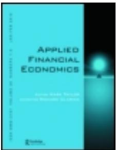

This article was downloaded by: [University of Western Cape]   
On: 26 November 2012, At: 00:31   
Publisher: Routledge   
Informa Ltd Registered in England and Wales Registered Number: 1072954 Registered office:   
Mortimer House, 37-41 Mortimer Street, London W1T 3JH, UK

## Applied Financial Economics

Publication details, including instructions for authors and subscription   
information:   
http://www.tandfonline.com/loi/rafe20

## Portfolio hedging and basis risks

Kian-Guan Lim

Version of record first published: 06 Oct 2010.

To cite this article: Kian-Guan Lim (1996): Portfolio hedging and basis risks, Applied Financial Economics, 6:6, 543-549

To link to this article: http://dx.doi.org/10.1080/096031096334006

## PLEASE SCROLL DOWN FOR ARTICLE

## Full terms and conditions of use: http://www.tandfonline.com/page/terms-and-conditions

This article may be used for research, teaching, and private study purposes. Any substantial or systematic reproduction, redistribution, reselling, loan, sub-licensing, systematic supply, or distribution in any form to anyone is expressly forbidden.

The publisher does not give any warranty express or implied or make any representation that the contents will be complete or accurate or up to date. The accuracy of any instructions, formulae, and drug doses should be independently verified with primary sources. The publisher shall not be liable for any loss, actions, claims, proceedings, demand, or costs or damages whatsoever or howsoever caused arising directly or indirectly in connection with or arising out of the use of this material.

# Portfolio hedging and basis risks

KIAN-GUAN LIM

Department of Finance and Banking, Faculty of Business Administration, National University of Singapore, 10 Kent Ridge Crescent, Singapore 0511

Minimum variance hedged portfolios using futures are formed by taking the linear projection of spot price changes onto futures price movements as the hedge ratio. This unwittingly assumes that the underlying spotÐfutures price movements follow a cointegrated process, given that the spot and the futures prices are integrated processes. If the spotÐfutures prices are not cointegrated, the hedged portfolio su€ers from the risk of potentially large changes in its value. Empirical ®ndings using the Nikkei stock index and the Nikkei 225 futures show this deviation in intraday trading prices. The basis movements which have often been used by intraday traders to predict future price changes, are tested to be mostly unit root processes. This is shown to be due largely to non-cointegratio n of the spotÐfutures prices, and suggests why it is pro®table to trade futures using basis knowledge only if trading is done on a continual basis.

## I. INTRODUCTION

Hedgers of price risks in ®nancial assets have to determine the amount of futures contract to buy or sell to insure against equity portfolio risks. Obviously the optimal amount depends on the hedger’s risk preference (Stulz, 1984; Figlewski, 1985). More commonly, the minimum variance hedge ratio is assumed (Ederington, 1979; and Frankcle, 1980), and such hedged portfolios are then examined to see if ex post risk is minimal. In determining the minimum variance hedge ratio, spot price changes are linearly projected onto the futures price changes, and the least squares estimate of the slope coe cient is used.

I show that, if the spotÐfutures prices are not cointegrated, the hedged portfolio su€ ers from the risk of potentially large changes in its value, which is not well recognized. Existing studies limit themselves to basis risks; see a thorough study in Figlewski (1984). Basis risk appears to have been explicitly or implicitly modelled as a discrete stationary process. This paper also shows how it is possible that the basis could also be an integrated process and relates it to the cointegration econometrics framework developed below. Empirical testing is performed and implications are then drawn about hedged portfolio value and basis trading regimes.

I shall ®rstly set up the usual nomenclature for the econometric modelling of spot-futures relationship. Let S denote the spot price level, F the futures price level, and assume 0960Ð3107 Ó 1996 Routledge

a general linear process

$$
S _ { t } = \alpha + \eta + \beta F _ { t } + \varepsilon _ { t }
$$

where a, g, and $\beta$ are constants, t is a time index, e is a mean-zero residual error and the subscript t indicates realization in period t. The ®rst di€erences in the levels are related as

$$
\Delta S _ { t } = \gamma + \beta \Delta F _ { t } + \Delta \varepsilon _ { t }
$$

The value change in the minimum variance hedge portfolio can then be represented by $\Delta S _ { t } - \beta \Delta F _ { t } , \mathrm { o r } \ \gamma + \Delta \varepsilon _ { t }$ in each period t.

Over an interval of time, say n + 1 periods, the cumulative value change is

$$
( n + 1 ) \gamma + \sum _ { t = j } ^ { j + n } \Delta \varepsilon _ { t }
$$

If $\Delta \varepsilon _ { t }$ is stationary and independently distributed, the variance of the cumulative value change increases linearly with time. The implication is that the hedged portfolio value follows a random walk. If $\Delta \varepsilon _ { t }$ is stationary but serially correlated, it is possible for the variance of the hedged portfolio value change to exhibit non-linear patterns over time.

Finance literature has gathered much empirical evidence about price levels being unit root processes (Baillie and Bollerslev, 1989; Corbae and Ouliaris, 1988; Corbae, Lim and Ouliaris, 1992). Suppose $S _ { t }$ and $\boldsymbol { F } _ { t }$ are unit root or $I ( 1 )$ processes, then an interesting issue is whether or not $S _ { t }$ and $F _ { t }$ are cointegrated with cointegrating vector $( 1 , \ - \beta )$ . If $S _ { t }$ and $F _ { t }$ are not cointegrated, then $\varepsilon _ { t }$ is typically an I(1) process and $\Delta \varepsilon _ { t }$ is stationary though not necessarily independently distributed. This leads to the hedged portfolio value following a random walk.

However, if $S _ { t }$ and $F _ { t }$ are cointegrated, $\varepsilon _ { t }$ is itself stationary though not necessarily independent over time. The hedged portfolio’s cumulative value change can then be characterized as

$$
( n + 1 ) \gamma + \sum _ { t = j } ^ { j + n } ( \varepsilon _ { t + 1 } - \varepsilon _ { t } )
$$

or $( n + 1 ) \gamma + \varepsilon _ { j + n + 1 } - \varepsilon _ { j }$ . Whatever the length of time, i.e. whatever n may be, the variance or risk of this cumulative change is constant. Thus the hedged portfolio value will not deviate with increasing unpredictability over time.

The above arguments show clearly the necessity of performing a cointegrating regression analysis of the spotÐ futures price levels. This will help determine whether hedged portfolios are of any use in preserving capital value over any interval of time. In the following section, I discuss the cointegration theory and motivate the use of the canonical cointegrating regression (CCR) technique developed by Park (1988). Section III reports tests of the unit root hypotheses of the spot and futures price levels and the basis for the Nikkei 225 index and the futures contract. Section IV contains results of the CCR and also shows a robust result concerning the I(1) nature of the basis. Apart from implications on portfolio hedging, the results also have implications for intraday trading and suggest how past basis movements could be exploited to yield pro®table information on the future basis change. Section V contains the conclusions.

## II. COINTEGRATING REGRESSION

This section contains a brief review of cointegration theory (Engle and Granger, 1987) and relates the theory to the regression methodology employed in this paper.

A cointegrated regression may be written as

$$
S _ { t } = \omega _ { 1 } \left( \theta _ { 1 } , \mathrm { t } \right) + \beta ^ { \prime } F _ { t } + u _ { t }
$$

where $\omega _ { 1 } \left( \theta _ { 1 } , t \right)$ is a deterministic function assumed to depend on time t and is parametrized by $\theta _ { 1 }$ . b is an m-vector of constants and the m-vector process $\boldsymbol { F } _ { t }$ evolves according to

$$
F _ { t } = \omega _ { 2 } ( \theta _ { 2 } , t ) + F _ { t - 1 } + \nu _ { t }
$$

where $\mathbf { \omega } _ { \mathbf { \omega } _ { 2 } } ( \theta _ { 2 } , t )$ is an m-vector deterministic function. Moreover, $u _ { t }$ and $v _ { t }$ are random variables of stationary processes. Therefore, $( S _ { t } { \cal F } _ { t } ^ { \prime } ) ^ { \prime }$ is an $( m + 1 )$ )-vector integrated order one, $I ( 1 ) ,$ , process. In the spotÐfutures relationship that we are examining , $m = 1$

The usual alternative approach to regression involving these levels is to apply OLS regression involving ®rst di€erences. However, the cointegrating regression technique yields signi®cant advantages over the conventional econometric methodology such as OLS on ®rst di€erences.

Stock (1987) and Park and Phillips (1988) have shown that, when OLS is applied to the cointegrated regression, the parameter estimates converge to the true parameter b at the rate $T$ (sample size), faster than $\sqrt { T }$ for the conventional case. Faster convergence occurs because the sample moments of the component $\boldsymbol { F } _ { t }$ are an order of magnitude larger than the sample moments of $u _ { t } ,$ and this dominates the impact of any correlation that may exist between the innovations in $\boldsymbol { F } _ { t }$ and the true error term $u _ { t } .$ This so-called superconsistency result continues to hold even in the presence of contemporaneous correlation in $u _ { t } ,$ endogeneity of $\boldsymbol { F } _ { t }$ and stationary measurement error in $S _ { t }$ and $\boldsymbol { F } _ { t }$

However, the advantages in favour of OLS disappear if $S _ { t }$ and $\boldsymbol { F } _ { t }$ do not form a cointegrated system. Speci®cally, when $u _ { t }$ is itself an integrated process, i.e. $S _ { t }$ and $\boldsymbol { F } _ { t }$ are not cointegrated, then applying OLS leads to \`spurious’ regression results (Granger and Newbold, 1974; Phillips, 1986). In particular, OLS parameter estimates, though unbiased, are inconsistent when $u _ { t }$ is an integrated process, and the conventional $t -$ and F-ratio statistics do not possess limiting distributions. Also, the DurbinÐWatson statistic converges in probability to zero, whereas $R ^ { 2 }$ has a nondegenerate limiting distribution as the sample size approaches in®nity.

I now present an applied methodology, as in Corbae et al. (1992), for the estimation and testing of cointegrated regressions. Since the existing literature maintains priors of $I ( 1 )$ about the price processes and maintains that spot and futures prices are cointegrated, I employ test statistics that use these priors as null hypotheses. This has the e€ect of minimal type I error. It also explains why some other cointegration tests that are based on di€erent nulls are not employed here.

Step 1 Pretest the time-series data $S _ { t }$ and $\boldsymbol { F } _ { t }$ to determine if the data are consistent with the I(1) hypothesis. More generally, a time trend is allowed in the $I ( 1 )$ speci®cations. Park and Choi (1988) suggested a J-statistic for the unit root test which was shown to have minimum size distortion bias. The $Z _ { \alpha }$ and the $Z _ { t }$ statistics (Phillips, 1987) are also used for comparison. An application of the J-statistic is reported in Lim and Phoon (1991).

The J-statistic is de®ned as

$$
J ( p , q ) = ( R S S _ { p } - R S S _ { q } ) / R S S _ { q } \qquad { \mathrm { f o r ~ } } 0 < p < q
$$

where $R S S _ { k }$ for $k = p , q$ is the residual sum of squares from the regression of $S _ { t }$ on a constant, $S _ { t ^ { - } 1 }$ , and time variables $t , \ t ^ { 2 } , \ { \overline { { t } } } ^ { 3 } , \ldots , t ^ { k } .$ . Intuitively, this statistic is a test of the restrictions of the $( p + 1 ) \mathrm { t h }$ to qth terms of the time polynomial being zero. If ®tting higher time polynomials is able to explain variations in $S _ { t } ,$ the resulting higher value of the J-statistic indicates the existence of a unit root.

Step 2 Estimate the coecient b using the canonical cointegrating regression (CCR) technique developed by Park (1988). Then test whether $S _ { t }$ and $\boldsymbol { F } _ { t }$ are cointegrated using Park’s (1988) $H ( p , q ) , q > p ,$ statistic. This statistic is based on a null hypothesis of cointegration, i.e. stationary error, allowing for deterministic time trend up to the pth order. If the regression is cointegrated with irrelevant polynomial time trends, the application of CCR should yield insigni®cant coecients on these variables. The $H ( p , q )$ statistic also possesses an asymptotic $\chi _ { \boldsymbol { q } ^ { - } \boldsymbol { p } } ^ { 2 }$ distribution.

The CCR regression technique is based on a GLS-type correction to the original data; Park (1988) gives the details of the technique. The transformation is designed to yield an estimate for b that permits conventional hypothesis testing. In particular, hypothesis testing may be conducted using conventional asymptotic $\chi ^ { 2 }$ statistics. Park (1988) develops the CCR procedure under mild regularity conditions for the innovation sequences driving $S _ { t }$ and $\boldsymbol { F } _ { t }$

Moreover, the CCR estimator has the advantage that the error process is speci®ed in a non-parametri c fashion, and can easily accommodate deterministic non-stationarity in $S _ { t }$ and $\boldsymbol { F } _ { t }$ such as that arising from a constant term and a time trend.

## III. PRICE PROPERTIES OF THE NIKKEIINDEX AND FUTURES

Research on the Japanese stock market and the Nikkei 225 futures market has been gaining momentum over the last several years (Bailey, 1989; Brenner et al., 1989; Lim, 1992a; Ziemba, 1990). With the wide price swings in the Japanese stock market, whereby in intraday trades it is common for the Nikkei 225 index to swing several hundred points either way, or up to 5% of the total index value, hedging using the Nikkei 225 stock index futures is a signi®cant activity. The futures contract was ®rst traded in the Singapore International Monetary Exchange in 1986 and also in the Osaka Exchange in 1989.

Using intraday futures trading data over 20 days at 5-minute intervals and matching it with the Nikkei 225 index reported at these same intervals, unit root tests were performed on the time series properties of the index level, the futures price level and the basis. The 20 trading days were randomly selected from four contracts: June 1988, September 1988, June 1989 and September 1989. Each daily data set comprises time-stamped transaction records showing the traded prices. At each 5-minute interval throughout the trading day, the traded price just before the end of the interval was matched with the \`QUICK’-reported Nikkei spot index at the end of the interval.

The computed test statistics are based on the null hypotheses of unit roots for the price levels and the basis; they are the J-statistic developed by Park and Choi (1988), and the $Z _ { \alpha }$ and $Z _ { t }$ statistics of Phillips (1987). The empirical results are reported in Table 1. Statistics that fall below the critical value indicate rejection of the null at that signi®- cance level.

Table 1 shows that the futures prices behave as I(1) process except for day 17 when both the $Z _ { \alpha }$ and $Z _ { t }$ statistics indicate rejection of the null at 1% signi®cance. The spot prices also behave as an $I ( 1 )$ process except for days 3 and 12, when the $Z _ { t }$ statistics indicate rejection of the null at 1% signi®cance. The basis appears to follow an I(1) process for the most part, although it could well be stationary on some days, e.g. days 4, 9, and 12 when the $Z _ { t }$ statistics indicate rejection of the null at 1% signi®cance. It would appear that the $Z _ { t }$ statistic is more powerful than the $Z _ { \alpha }$ and J-statistics, though Lim and Phoon (1991) discussed the bias towards rejection in the Z-statistics relative to the J-statistics.

## IV. COINTEGRATION TESTS

In this section, I use the canonical cointegration regression of Park (1988). The following regression is performed:

$$
\boldsymbol { S } _ { t } = \boldsymbol { \alpha } + \boldsymbol { \gamma } t + \boldsymbol { \beta } \boldsymbol { F } _ { t } + \boldsymbol { \varepsilon } _ { t }
$$

The CCR technique yields consistent estimates of $\alpha , \gamma$ and b provided that $\varepsilon _ { t }$ is stationary. Consistency still obtains even if $\boldsymbol { F } _ { t }$ and $\varepsilon _ { t }$ are not independent, as this bias reduces to zero asymptotically. Such desirable features of estimation using CCR cannot be obtained with OLS regression on the ®rst di€ erences. As indicated in the previous section, that $S _ { t }$ and $\boldsymbol { F } _ { t }$ are typically I(1) processes provides the justi®cation for applying the CCR technique.

The intraday spot prices are regressed against a constant, time, and the matched futures prices for each of the 20 trading days. The $H ( p , q )$ statistic developed by Park (1988) to test for deviation from the null of cointegration is computed in each regression. Based on the null of a linear time trend and ®tting additional time polynomials to degree 3 yields a $\chi ^ { 2 }$ distribution with two degrees of freedom for the H-statistic under the null. The estimates and test statistics are reported in Table 2.

From the CCR of spot prices on futures prices, the H-statistics indicate rejection of the null of cointegration for days 12, 15, 18 and 20 at 1% signi®cance, and for days 1, 3, 6 and 9 at 5% signi®cance. In other words, there are many days (40% of my sample) in which a hedged portfolio value behaves like a random walk. In these cases, the portfolios are unlikely to o€er protection against extreme movements in spot prices.

On the other days, when the null of cointegration is not rejected, the minimum variance hedge ratios are estimated to range from about 0.2 to 1.4 with the majority of cases being close to but below 1. To con®rm this ®nding, an OLS regression of spot price changes on futures price changes was also performed. The results are reported in Table 3.

Table 1. Unit root tests of futures prices, spot prices, and basis of the Nikkei 225 contract using the J-statistic and Phillips’ Z-statistics
<table><tr><td>Contract</td><td>J(1, 5)</td><td> $Z _ { \alpha } ( 1 , 5 )$ </td><td>Z{(1, 5)</td><td>Contract</td><td>J(1, 5)</td><td> $Z _ { \alpha } ( 1 , 5 )$ </td><td>Z{(1, 5)</td></tr><tr><td>June 1988</td><td></td><td></td><td></td><td>June 1989</td><td></td><td></td><td></td></tr><tr><td>Trading day 1</td><td></td><td></td><td></td><td>Trading day 11</td><td></td><td></td><td></td></tr><tr><td>Futures</td><td>0.956</td><td>-19.065</td><td>- 3.788a</td><td>Futures</td><td>0.179</td><td>-19.414</td><td>-3.432</td></tr><tr><td>Spot</td><td>6.509</td><td>-7.752</td><td>- 2.058</td><td>Spot</td><td>2.593</td><td>-20.314</td><td>-3.344</td></tr><tr><td>Basis</td><td>8.163</td><td>-2.720</td><td>-0.683</td><td>Basis</td><td>2.994</td><td>- 19.235</td><td>-3.131</td></tr><tr><td>Trading day 2</td><td></td><td></td><td></td><td>Trading day 12</td><td></td><td></td><td></td></tr><tr><td>Futures</td><td>2.926</td><td>-12.000</td><td>- 1.996</td><td>Futures</td><td>0.977</td><td>-14.601</td><td>-2.715</td></tr><tr><td>Spot</td><td>0.609</td><td>- 14.320</td><td>- 2.946</td><td>Spot</td><td>2.401</td><td>-23.772</td><td>- 4.948b</td></tr><tr><td>Basis</td><td>0.604</td><td>-14.043</td><td>-2.760</td><td>Basis</td><td>4.845</td><td>- 18.902</td><td>- 4.707b</td></tr><tr><td>Trading day 3</td><td></td><td></td><td></td><td>Trading day 13</td><td></td><td></td><td></td></tr><tr><td>Futures</td><td>0.254ª</td><td>- 21.490ª</td><td>- 3.740a</td><td>Futures</td><td>4.438</td><td>-5.226</td><td>-1.795</td></tr><tr><td>Spot</td><td>2.149</td><td>- 25.163a</td><td>- 4.845b</td><td>Spot</td><td>5.624</td><td>-4.826</td><td>-1.597</td></tr><tr><td>Basis</td><td>3.728</td><td>- 15.451</td><td>-3.438</td><td>Basis</td><td>2.039</td><td>-17.081</td><td>- 3.604a</td></tr><tr><td>Trading day 4</td><td></td><td></td><td></td><td>Trading day 14</td><td></td><td></td><td></td></tr><tr><td>Futures</td><td>1.219</td><td>-8.613</td><td>-2.091</td><td>Futures</td><td>1.361</td><td>-13.803</td><td>-2.965</td></tr><tr><td>Spot</td><td>3.141</td><td>- 15.621</td><td>- 4.003a</td><td>Spot</td><td>6.388</td><td>- 15.279</td><td>- 3.592a</td></tr><tr><td>Basis</td><td>8.910</td><td>-18.616</td><td>- 5.389b</td><td>Basis</td><td>4.398</td><td>-17.055</td><td>- 3.866a</td></tr><tr><td>Trading day 5</td><td></td><td></td><td></td><td>Trading day 15</td><td></td><td></td><td></td></tr><tr><td>Futures</td><td>6.485</td><td>-2.061</td><td>-0.720</td><td>Futures</td><td>3.252</td><td>-8.862</td><td>- 2.393</td></tr><tr><td>Spot</td><td>9.761</td><td>-2.580</td><td>- 0.994</td><td>Spot</td><td>3.153</td><td>-14.781</td><td>- 3.993a</td></tr><tr><td>Basis</td><td>2.596</td><td>-5.275</td><td>- 1.312</td><td>Basis</td><td>2.361</td><td>-16.615</td><td>-3.607a</td></tr><tr><td>September 1988</td><td></td><td></td><td></td><td>September 1989</td><td></td><td></td><td></td></tr><tr><td>Trading day 6</td><td></td><td></td><td></td><td>Trading day 16</td><td></td><td></td><td></td></tr><tr><td>Futures</td><td>1.267</td><td>-10.830</td><td>- 2.823</td><td>Futures</td><td>0.630</td><td>-17.225</td><td>- 3.581a</td></tr><tr><td>Spot</td><td>1.470</td><td>- 6.940</td><td>-1.464</td><td>Spot</td><td>1.498</td><td>-11.049</td><td>-2.497</td></tr><tr><td>Basis</td><td>3.924</td><td>- 14.183</td><td>-3.115</td><td>Basis</td><td>2.762</td><td>-9.055</td><td>- 2.426</td></tr><tr><td>Trading day 7</td><td></td><td></td><td></td><td>Trading day 17</td><td></td><td></td><td></td></tr><tr><td>Futures</td><td>0.445</td><td>- 21.794a</td><td>- 3.758a</td><td>Futures</td><td>0.336</td><td>- 30.956b</td><td>- 4.895b</td></tr><tr><td>Spot</td><td>4.766</td><td>-6.428</td><td>- 2.210</td><td>Spot</td><td>0.157a</td><td>- 22.538a</td><td>- 3.828a</td></tr><tr><td>Basis</td><td>1.291</td><td>- 13.301</td><td>-3.229</td><td>Basis</td><td>0.148</td><td>- 21.302ª</td><td>- 3.926a</td></tr><tr><td>Trading day 8</td><td></td><td></td><td></td><td>Trading day 18</td><td></td><td></td><td></td></tr><tr><td>Futures</td><td>2.240</td><td>-7.386</td><td>-1.443</td><td>Futures</td><td>24.598</td><td>-4.101</td><td>-1.487</td></tr><tr><td>Spot</td><td>1.864</td><td>-17.008</td><td>- 3.882a</td><td>Spot</td><td>1.363</td><td>-10.051</td><td>-2.569</td></tr><tr><td>Basis</td><td>2.121</td><td>-19.062</td><td>-3.677a</td><td>Basis</td><td>1.209</td><td>-11.377</td><td>-2.721</td></tr><tr><td>Trading day 9</td><td></td><td></td><td></td><td>Trading day 19</td><td></td><td></td><td></td></tr><tr><td>Futures</td><td>1.646</td><td>-6.314</td><td>-1.797</td><td>Futures</td><td>1.802</td><td>-11.630</td><td>-2.305</td></tr><tr><td>Spot</td><td>3.373</td><td>-8.718</td><td>-2.996</td><td>Spot</td><td>1.439</td><td>-15.922</td><td>- 3.568a</td></tr><tr><td>Basis</td><td>1.222</td><td>-20.087</td><td>- 4.808b</td><td>Basis</td><td>2.376</td><td>-13.831</td><td>-2.460</td></tr><tr><td>Trading day 10</td><td></td><td></td><td></td><td>Trading day 20</td><td></td><td></td><td></td></tr><tr><td>Futures</td><td>1.642</td><td>- 14.631</td><td>-3.379</td><td>Futures</td><td>5.323</td><td>- 4.411</td><td>-1.274</td></tr><tr><td>Spot</td><td>1.584</td><td>- 11.113</td><td>2.482</td><td>Spot</td><td>1.530</td><td>-8.342</td><td>-1.821</td></tr><tr><td>Basis</td><td>2.024</td><td>-19.730</td><td>4.017a</td><td>Basis</td><td>0.369</td><td>-12.938</td><td>- 2.891</td></tr></table>

Notes: Critical values 1%, 5%  
J-statistic 0.117, 0.294  
$Z _ { \alpha }$ statistic - 27.702, - 20.724  
Z statistic - 4.144, - 3.540  
a For $H _ { 0 } { \mathrm { : } }$ I(1); reject null at 5% signi®cance level.  
b For $H _ { 0 } \ I ( 1 )$ reject null at 1% signi®cance level.

The t-statistics of the slope coecient estimators show clearly that spot price changes and futures price changes are signi®cantly positively correlated. The coe cient estimates are similar in magnitudes to those in the CCR. This con-®rms the CCR ®ndings. The signi®cant positive correlations between stock index price changes and the corresponding futures price changes are also reported in other studies such as Kawaller et al. (1987) and Lim (1991b).

Using the CCR estimates reported in Table 2, I also test if these estimates are signi®cantly di€ erent from unity. The test statistics and p-values are reported in Table 4. The null hypothesis of unit slope cannot be rejected at the 5% signi®- cance level for 13 out of the 20 days. If I eliminate the cases of non-cointegration , as discussed earlier, the null cannot be rejected in 8 out of 12 days. This turns out to be about 67% of the cases. This means that both price changes are highly correlated.

Table 2. Canonical cointegrating regression of spot price on futures price of the Nikkei 225 contract
<table><tr><td>Contract</td><td>Constant</td><td>Time</td><td>Futures</td><td> $\chi _ { 2 } ^ { 2 }$ </td><td>Contract</td><td>Constant</td><td>Time</td><td>Futures</td><td> $\chi _ { 2 } ^ { 2 }$ </td></tr><tr><td>June 1988</td><td></td><td></td><td></td><td></td><td>June 1989</td><td></td><td></td><td></td><td></td></tr><tr><td>Trading day 1 Coefficients</td><td>1406.336</td><td>495.935</td><td>0.944</td><td>9.217</td><td>Trading day 11 Coefficients</td><td>26557.046</td><td>-92.075</td><td>0.172</td><td>2.471</td></tr><tr><td>p-value</td><td>(0.452)</td><td>(0.026)</td><td>(0.021)</td><td>(0.010)a</td><td>p-value</td><td>(0.022)</td><td>(0.665)</td><td>(0.331)</td><td>(0.291)</td></tr><tr><td>Trading day 2 Coefficients</td><td>-711.757</td><td>157.332</td><td>1.025</td><td>2.390</td><td>Trading day 12 Coefficients</td><td>2731.782</td><td>857.874</td><td>0.899</td><td>9.992</td></tr><tr><td>p-value</td><td>(0.476)</td><td>(0.131)</td><td>(0.013)</td><td>(0.303)</td><td>p-value</td><td>(0.392)</td><td>(0.001)</td><td>(0.002)</td><td>(0.007)b</td></tr><tr><td>Trading day 3 Coefficients</td><td>7169.333</td><td>321.770</td><td>0.728</td><td>6.733</td><td>Trading day 13 Coefficients</td><td>-14130.316</td><td>353.290</td><td>1.419</td><td>2.839</td></tr><tr><td>p-value Trading day 4</td><td>(0.072)</td><td>(0.015)</td><td>(0.000)</td><td>(0.035)a</td><td>p-value Trading day 14</td><td>(0.002)</td><td>(0.063)</td><td>(0.000)</td><td>(0.242)</td></tr><tr><td>Coefficients p-value Trading day 5</td><td>9106.653 (0.168)</td><td>311.118 (0.067)</td><td>0.658 (0.035)</td><td>5.764 (0.056)</td><td>Coefficients p-value Trading day 15</td><td>1359.120 (0.448)</td><td>274.749 (0.074)</td><td>0.952 (0.002)</td><td>4.397 (0.111)</td></tr><tr><td>Coefficients p-value</td><td>10936.946 (0.000)</td><td>165.030 (0.021)</td><td>0.592 (0.000)</td><td>3.245 (0.197)</td><td>Coefficients p-value</td><td>23446.772 (0.001)</td><td>842.053 (0.004)</td><td>0.295 (0.079)</td><td>10.597 (0.005)b</td></tr><tr><td>September 1988 Trading day 6</td><td></td><td></td><td></td><td></td><td>September 1989 Trading day 16</td><td></td><td></td><td></td><td></td></tr><tr><td>Coefficients p-value</td><td>12502.338 (0.031)</td><td>236.758 (0.063)</td><td>0.558 (0.010)</td><td>8.680</td><td>Coefficients p-value</td><td>9978.626 (0.388)</td><td>642.750 (0.051)</td><td>0.711</td><td>3.955 (0.138)</td></tr><tr><td>Trading day 7</td><td></td><td></td><td></td><td>(0.013)a</td><td>Trading day 17</td><td></td><td></td><td>(0.242)</td><td></td></tr><tr><td>Coefficients p-value</td><td>3846.225 (0.401)</td><td>289.014 (0.127)</td><td>0.868 (0.060)</td><td>3.074 (0.215)</td><td>Coefficients p-value</td><td>-1700.521 (0.386)</td><td>130.498 (0.119)</td><td>1.041</td><td>3.865 (0.145)</td></tr><tr><td>Trading day 8</td><td></td><td></td><td></td><td></td><td>Trading day 18</td><td></td><td></td><td>(0.000)</td><td></td></tr><tr><td>Coefficients</td><td>7455.679</td><td>95.913</td><td>0.733</td><td>3.320</td><td>Coefficients</td><td>696.050</td><td>261.977</td><td>0.973</td><td>34.272</td></tr><tr><td>p-value</td><td>(0.254)</td><td>(0.349)</td><td>(0.037)</td><td>(0.190)</td><td>p-value</td><td>(0.394)</td><td>(0.000)</td><td>(0.000)</td><td>(0.000)b</td></tr><tr><td>Trading day 9</td><td></td><td></td><td></td><td></td><td>Trading day 19</td><td></td><td></td><td></td><td></td></tr><tr><td>Coefficients</td><td>3916.615</td><td>-1151.798</td><td></td><td></td><td></td><td>24474.287</td><td></td><td></td><td></td></tr><tr><td></td><td></td><td></td><td>0.860</td><td>6.703</td><td>Coefficients</td><td></td><td>107.415</td><td>0.290</td><td>2.686</td></tr><tr><td>p-value</td><td>(0.233)</td><td>(0.010)</td><td>(0.000)</td><td>(0.035)a</td><td>p-value</td><td>(0.000)</td><td>(0.204)</td><td>(0.047)</td><td>(0.261)</td></tr><tr><td>Trading day 10</td><td></td><td></td><td></td><td></td><td></td><td></td><td></td><td></td><td></td></tr><tr><td></td><td></td><td></td><td></td><td></td><td>Trading day 20</td><td></td><td></td><td></td><td></td></tr><tr><td></td><td></td><td></td><td></td><td></td><td></td><td></td><td></td><td></td><td></td></tr><tr><td>Coefficients</td><td></td><td></td><td></td><td></td><td></td><td>24290.606</td><td>-168.540</td><td>0.289</td><td>11.425</td></tr><tr><td></td><td></td><td></td><td>0.699</td><td></td><td></td><td></td><td></td><td></td><td></td></tr><tr><td></td><td></td><td>130.715</td><td></td><td>1.420</td><td>Coefficients</td><td></td><td></td><td></td><td></td></tr><tr><td></td><td>8154.007</td><td></td><td></td><td></td><td></td><td></td><td></td><td></td><td></td></tr><tr><td></td><td></td><td></td><td></td><td></td><td></td><td></td><td></td><td></td><td></td></tr><tr><td></td><td></td><td></td><td></td><td></td><td></td><td></td><td></td><td></td><td>(0.003)b</td></tr><tr><td></td><td></td><td></td><td></td><td></td><td></td><td></td><td>(0.069)</td><td></td><td></td></tr><tr><td></td><td></td><td></td><td></td><td></td><td></td><td></td><td></td><td></td><td></td></tr><tr><td></td><td></td><td></td><td></td><td></td><td></td><td></td><td></td><td>(0.004)</td><td></td></tr><tr><td>p-value</td><td></td><td></td><td></td><td></td><td></td><td>(0.000)</td><td></td><td></td><td></td></tr><tr><td></td><td></td><td>(0.269)</td><td>(0.015)</td><td>(0.492)</td><td></td><td></td><td></td><td></td><td></td></tr><tr><td></td><td>(0.173)</td><td></td><td></td><td></td><td>p-value</td><td></td><td></td><td></td><td></td></tr><tr><td></td><td></td><td></td><td></td><td></td><td></td><td></td><td></td><td></td><td></td></tr><tr><td></td><td></td><td></td><td></td><td></td><td></td><td></td><td></td><td></td><td></td></tr><tr><td></td><td></td><td></td><td></td><td></td><td></td><td></td><td></td><td></td><td></td></tr><tr><td></td><td></td><td></td><td></td><td></td><td></td><td></td><td></td><td></td><td></td></tr><tr><td></td><td></td><td></td><td></td><td></td><td></td><td></td><td></td><td></td><td></td></tr><tr><td></td><td></td><td></td><td></td><td></td></table>

Notes: $H _ { 0 } { \mathrm { : } }$ cointegration; test statistic is $H ( 1 , 3 ) = \chi ^ { 2 }$ d.f. 2; reject H0 given one-tailed test if H is too large.  
a Reject H0 at 5% signi®cance level.  
b Reject H0 at 1% signi®cance level.

This result has certain implications on the basis as de®ned by the di€erence of futures price and the spot price. The basis is then

$$
( \mathbf { 1 } - \mathsf { \beta } ) \boldsymbol { F } _ { t } - \boldsymbol { \alpha } - \boldsymbol { \gamma } t - \boldsymbol { \varepsilon } _ { t }
$$

If b is unity, the basis is stationary except with a deterministic trend provided that the spotÐfutures prices are cointegrated. This happened in 8 out of 20 days using our sample. If b is not unity in the cointegrated regression, the basis possesses a unit root as $\boldsymbol { F } _ { t }$ is an I(1) process. The results in Table 4 show that b is often close, if not equal to, unity. Thus, any signi®cant appearance of a unit root in the basis is due more to the fact that the spot and futures prices are not cointegrated. This suggestion is corroborated by the empirical evidence presented in Table 1 that the basis is mostly an I(1) process.

If the regression is not cointegrated, then whether or not b is unity, the basis possesses a unit root due to $\varepsilon _ { t }$ being I(1). In trading days 1, 3, 6, 18 and 20, in which non-cointegration is detected as in Table 2, the basis is also shown to be I(1) as reported in Table 1. And in trading days 5, 6, 11, 19 and 20, in which b is unlikely to be unity, as reported in Table 4, the bases as reported in Table 1 are also shown to be I(1). Empirically, these two possibilities of either non-cointegration or else non-unit b explain most of the cases of I (1) basis.

Table 3. Estimating optimal futures hedging coe¦cients of the Nikkei 225
<table><tr><td>Contract</td><td>Constant</td><td>β</td><td>F-value</td><td>Contract</td><td>Constant</td><td>β</td><td>F-value</td></tr><tr><td>June 1988</td><td></td><td></td><td></td><td>June 1989</td><td></td><td></td><td></td></tr><tr><td>Trading day 1</td><td></td><td></td><td></td><td>Trading day 11</td><td></td><td></td><td></td></tr><tr><td>Coefficients</td><td>0.935</td><td>0.910</td><td>15.482</td><td>Coefficients</td><td>-1.788</td><td>0.244</td><td>1.073</td></tr><tr><td>p-value</td><td>(0.296)</td><td>(0.000)</td><td>(0.000)</td><td>p-value</td><td>(0.278)</td><td>(0.106)</td><td>(0.351)</td></tr><tr><td>Trading day 2</td><td></td><td></td><td></td><td>Trading day 12</td><td></td><td></td><td></td></tr><tr><td>Coefficients</td><td>-0.897</td><td>0.898</td><td>11.196</td><td>Coefficients</td><td>- 6.158</td><td>0.869</td><td>12.450</td></tr><tr><td>p-value</td><td>(0.316)</td><td>(0.000)</td><td>(0.000)</td><td>p-value</td><td>(0.057)</td><td>(0.000)</td><td>(0.000)</td></tr><tr><td>Trading day 3</td><td></td><td></td><td></td><td>Trading day 13</td><td></td><td></td><td></td></tr><tr><td>Coefficients</td><td>2.296</td><td>0.741</td><td>26.099</td><td>Coefficients</td><td>2.022</td><td>0.477</td><td>6.707</td></tr><tr><td>p-value</td><td>(0.084)</td><td>(0.000)</td><td>(0.000)</td><td>p-value</td><td>(0.271)</td><td>(0.000)</td><td>(0.003)</td></tr><tr><td>Trading day 4</td><td></td><td></td><td></td><td>Trading day 14</td><td></td><td></td><td></td></tr><tr><td>Coefficients</td><td>- 0.109</td><td>0.329</td><td>2.356</td><td>Coefficients</td><td>4.105</td><td>0.261</td><td>2.800</td></tr><tr><td>p-value</td><td>(0.528)</td><td>(0.024)</td><td>(0.107)</td><td>p-value</td><td>(0.087)</td><td>(0.066)</td><td>(0.071)</td></tr><tr><td>Trading day 5</td><td></td><td></td><td></td><td>Trading day 15</td><td></td><td></td><td></td></tr><tr><td>Coefficients</td><td>-0.775</td><td>0.305</td><td>16.787</td><td>Coefficients</td><td>-0.370</td><td>0.502</td><td>8.473</td></tr><tr><td>p-value</td><td>(0.735)</td><td>(0.000)</td><td>(0.000)</td><td>p-value</td><td>(0.438)</td><td>(0.000)</td><td>(0.001)</td></tr><tr><td>September 1988</td><td></td><td></td><td></td><td>September 1989</td><td></td><td></td><td></td></tr><tr><td>Trading day 6</td><td></td><td></td><td></td><td>Trading day 16</td><td></td><td></td><td></td></tr><tr><td>Coefficients</td><td>0.466</td><td>0.414</td><td>13.898</td><td>Coefficients</td><td>-3.171</td><td>0.483</td><td>1.168</td></tr><tr><td>p-value</td><td>(0.341)</td><td>(0.000)</td><td>(0.000)</td><td>p-value</td><td>(0.242)</td><td>(0.081)</td><td>(0.325)</td></tr><tr><td>Trading day 7</td><td></td><td></td><td></td><td>Trading day 17</td><td></td><td></td><td></td></tr><tr><td>Coefficients</td><td>-1.308</td><td>0.443</td><td>14.119</td><td>Coefficients</td><td>-1.265</td><td>0.957</td><td>14.145</td></tr><tr><td>p-value</td><td>(0.847)</td><td>(0.000)</td><td>(0.000)</td><td>p-value</td><td>(0.397)</td><td>(0.000)</td><td>(0.000)</td></tr><tr><td>Trading day 8</td><td></td><td></td><td></td><td>Trading day 18</td><td></td><td></td><td></td></tr><tr><td>Coefficients</td><td>-4.854</td><td>0.512</td><td>22.159</td><td>Coefficients</td><td>-4.634</td><td>0.827</td><td>2.499</td></tr><tr><td>p-value</td><td>(0.008)</td><td>(0.000)</td><td>(0.000)</td><td>p-value</td><td>(0.280)</td><td>(0.019)</td><td>(0.105)</td></tr><tr><td>Trading day 9</td><td></td><td></td><td></td><td>Trading day 19</td><td></td><td></td><td></td></tr><tr><td>Coefficients</td><td>-4.367</td><td>0.335</td><td>4.861</td><td>Coefficients</td><td>-5.292</td><td>0.287</td><td>5.923</td></tr><tr><td>p-value</td><td>(0.132)</td><td>(0.003)</td><td>(0.012)</td><td>p-value</td><td>(0.014)</td><td>(0.010)</td><td>(0.006)</td></tr><tr><td>Trading day 10</td><td></td><td></td><td></td><td>Trading day 20</td><td></td><td></td><td></td></tr><tr><td>Coefficients</td><td>2.870</td><td>0.548</td><td>6.628</td><td>Coefficients</td><td>-1.758</td><td>0.381</td><td>1.162</td></tr><tr><td>p-value</td><td>(0.190)</td><td>(0.000)</td><td>(0.003)</td><td>p-value</td><td>(0.385)</td><td>(0.075)</td><td>(0.331)</td></tr></table>

When the basis $b _ { t }$ follows a unit root process, I can write

$$
b _ { t } = b _ { t - 1 } + \eta _ { t }
$$

where $\eta _ { t }$ is a residual error not correlated with $b _ { t ^ { - } 1 }$ , but is not necessarily mean zero or independent over time. This implies that intraday traders can obtain the best prediction about future basis movement by taking note of the past basis movements. Information on the future basis changes are fully incorporated in the current basis. However, it is imperative that such traders watch and trade on a continual basis in order to pro®t from the past basis information. This is because, if the interval for forecast of future basis is widened, then since $b _ { t }$ is an I(1) process, its variance increases over time. This increased variance introduces unnecessary uncertainties and risk for traders. The risk is minimized when the forecast is made on a continual basis. That this indeed is the case explains the proliferation of individual trades (also called independents on the SIMEX exchange ¯oor). These trades are typically in small orders and the traders would buy and sell continually. Of course, if $b _ { t }$ is stationary, then whatever the interval of forecast, the uncertainty remains the same.

## V. CONCLUSION

I have raised an issue regarding the optimal hedging of spot positions using futures. Employing the Nikkei 225 stocks and the Nikkei 225 futures, there is evidence that the spotÐfutures prices are not necessarily cointegrated on some trading days even though their ®rst di€erences are stationary. Non-cointegratio n in the price levels implies that the value of the hedged portfolio, in particular the minimum variance hedged portfolio, follows an I(1) process, or more speci®cally, a random walk. Such a price risk has not been well known in the existing literature on hedging, as far as I know.

Table 4. Canonical cointegrating regression of spot price on futures price: a test of unit optimal hedge ratio of the Nikkei 225 contracts
<table><tr><td>Trading day</td><td>t-statistic</td><td>p-value</td></tr><tr><td>1</td><td>-0.124</td><td>(0.451)</td></tr><tr><td>2</td><td>0.057</td><td>(0.477)</td></tr><tr><td>3</td><td>-1.470</td><td>(0.074)</td></tr><tr><td>4</td><td>- 0.961</td><td>(0.171)</td></tr><tr><td>5</td><td>- 6.490</td><td>(0.000)b</td></tr><tr><td>6</td><td>-1.892</td><td>(0.032)a</td></tr><tr><td>7</td><td>- 0.242</td><td>(0.405)</td></tr><tr><td>8</td><td>-0.664</td><td>(0.255)</td></tr><tr><td>9</td><td>- 0.707</td><td>(0.242)</td></tr><tr><td>10</td><td>-0.974</td><td>(0.168)</td></tr><tr><td>11</td><td>- 2.114</td><td>(0.020)a</td></tr><tr><td>12</td><td>- 0.329</td><td>(0.372)</td></tr><tr><td>13</td><td>2.936</td><td>(0.003)b</td></tr><tr><td>14</td><td>-0.155</td><td>(0.439)</td></tr><tr><td>15</td><td>-3.432</td><td>(0.001)b</td></tr><tr><td>16</td><td>- 0.288</td><td></td></tr><tr><td>17</td><td>0.250</td><td>(0.388)</td></tr><tr><td></td><td>-0.364</td><td>(0.402)</td></tr><tr><td>18</td><td>- 4.215</td><td>(0.360)</td></tr><tr><td>19 20</td><td>-7.234</td><td>(0.000)b (0.000)b</td></tr></table>

Note: $H _ { 0 } { \mathrm { : } }$ slope coecient = 1.  
a Reject $H _ { 0 }$ at 5% signi®cance level.  
b Reject $H _ { 0 }$ at 1% signi®cance level.

I also provide unit root tests showing evidence that the basis is mostly an I (1) process. This is consistent with both cases of spotÐfutures cointegration or non-cointegration , provided the slope coecient of the spot price on futures price is not unity. Even if the slope is unity, non-cointegration in the spot-futures prices would induce an I (1) basis. A basis that possesses a random walk, a special case of I(1), implies that it is most pro®table for intratraders to use basis knowledge to trade on a continual basis.

This study contributes to the existing literature by characterizing hedged portfolio as well as basis behaviours in the cointegration framework. Empirical tests on the cointegration framework are performed and interesting ®nancial implications are drawn.

## ACKNOWLEDGEMENT

The author acknowledges the help of Sam Ouliaris in providing the cointegration programming softwares.

## REFERE NCES

Bailey, W. (1989) The market for Japanese stock index futures: some preliminary evidence, Journal of Futures Markets, 9, 283Ð95.

Baillie, R. T. and Bollerslev, T. (1989) Common stochastic trends in a system of exchange rates, Journal of Finance, XLIV, 167Ð81.

Brenner, M., Subrahmanyam, M. G. and Uno, J. (1989) The behavior of prices in the Nikkei spot and futures market, Journal of Financial Economics, 23, 363Ð83.

Corbae, D. and Ouliaris, S. (1988) Cointegration and tests of purchasing power parity, Review of Economics and Statistics, 70, 508Ð11.

Corbae, D., Lim, K. G. and Ouliaris, S. (1992) On cointegration and tests of forward market unbiasedness, Review of Economics and Statistics, 74, 728Ð32.

Ederington, L. H. (1979) The hedging performance of the new futures market, Journal of Finance, 34, 157Ð70.

Engle, R. F. and Granger, C. W. J. (1987) Cointegration and error correction: representation, estimation and testing, Econometrica, 55, 251Ð76.

Figlewski, S. (1984) Hedging performance and basis risk in stock index futures, Journal of Finance, 39, 657Ð69.

Figlewski, S. (1985) Hedging with stock index futures: theory and application in a new market, Journal of Futures Markets, 5, 183Ð99.

Frankcle, C. T. (1980) The hedging performance of the new futures market: comment, Journal of Finance, 35, 1273Ð79.

Granger, C. W. J. and Newbold, P. (1974) Spurious regressions in econometrics, Journal of Econometrics, 2, 111Ð20.

Kawaller, I. G., Koch, P. D. and Koch, T. W. (1987) The temporal price relationship between S&P 500 futures and the S&P 500 index, Journal of Finance, XLII, 1309Ð29.

Lim, K. G. (1992a) Arbitrage and price behavior of the Nikkei stock index futures, Journal of Futures Markets, 12, 151Ð61.

Lim, K. G. (1992b) Speculative, hedging and arbitrage e ciency of the Nikkei index futures, in PaciÞc-Basin Capital Markets Research, Vol. III, eds. S.G. Rhee and R.P. Chang, North-Holland, Amsterdam, pp. 441Ð61.

Lim, K. G. and Phoon, K. F. (1991) Tests of rational bubbles using cointegration theory, Applied Financial Economics, 1, 85Ð88.

Park, J. Y. (1988) Canonical cointegrating regressions, CAE Working Paper 88-29, Cornell University, Ithaca NY.

Park, J. Y. and Choi, B. (1988) A new approach to testing for a unit root, CAE Working Paper 88-23, Cornell University, Ithaca NY.

Park, J. Y. and Phillips, P. C. B. (1988) Statistical inferences in regressions with integrated processes 1, Econometric Theory, 4, 468Ð97.

Phillips, P. C. B (1986) Understanding spurious regressions in econometrics, Journal of Econometrics, 13, 311Ð40.

Phillips, P. C. B. (1987) Time series regression with a unit root, Econometrica, 55, 277Ð301.

Stock, J. H. (1987) Asymptotic properties of least squares estimators of cointegrating vectors, Econometrica, 55, 1035Ð56.

Stulz, R. M. (1984) Optimal hedging policies, Journal of Financial and Quantitative Analysis, 19, 127Ð40.

Ziemba, W. T. (1988) Seasonality e€ects in Japanese futures markets, in PaciÞc-Basin Capital Markets Research, ed. S. G. Rhee and R. P. Chang, North-Holland, Amsterdam, 379Ð407.