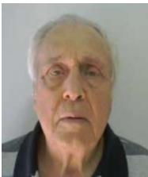

# GRUPO DE ESTUDO DE ASPECTOS EMPRESARIAIS E DE GESTÃO CORPORATIVA E DA INOVAÇÃO E DA EDUCAÇÃO E DE REGULAÇÃO DO SETOR ELÉTRICO - GEC

# ANÁLISE DAS TRAJETÓRIAS PÓS APOSENTADORIA DE ENGENHEIROS DAS EMPRESAS ESTATAIS E DE INSTITUIÇÕES DA NOVA GOVERNANÇA DO SETOR ELETRICO BRASILEIRO, VIS A VIS OS CONHECIMENTOS E CAPACIDADES ADQUIRIDOS NO DECORRER DA SUA VIDA PROFISSIONAL

ROBERTO JOSE RIBEIRO GOMES DA SILVA(1);CARMEN MARIA MOTA CARDOSO;GERALDO DA SILVA PIMENTEL FILHO ELAN CONSULTORES (1)

## RESUMO

Considerando o expressivo movimento nas estatais do setor elétrico brasileiro e nas instituições de seu nova governança, no sentido de redução do quadro de pessoal, este trabalho busca analisar como os conhecimentos adquiridos nas empresas de origem influenciaram e contribuíram no desenvolvimento das novas atividades pós aposentadoria a partir da identificação dos impactos da experiência da aposentadoria na vida dos profissionais; análise da utilização dos conhecimentos adquiridos nas capacitações realizadas nas empresas, sobre o desempenho nas atividades desenvolvidas pós aposentadoria e avaliação dos efeito dos conhecimentos adquiridos sobre as oportunidades para os profissionais no desenvolvimento de suas novas atividades.

PALAVRAS-CHAVE: Aposentadoria; Trajetórias; Escolhas de vida; Gestão do conhecimento; Políticas de gestão.

## 1.0 INTRODUÇÃO

Nos últimos dez anos, há um expressivo movimento no sentido de redução do quadro de pessoal nas empresas estatais e nas instituições de nova governança do setor elétrico brasileiro. O que tem orientado esse processo é a mudança do papel das instituições, a progressiva transferência de propriedade dos ativos e os novos arranjos empresariais para a expansão do setor. O objetivo comumente declarado pelos tomadores de decisão tem sido, principalmente, a redução de custos, a renovação e a competitividade.

É reconhecido e destacado o conhecimento produzido e transmitido aos empregados destas empresas estatais, ao longo das últimas décadas. Conhecimento este repassado, de maneira formal e informal, através das gerações de técnicos que com a devida qualificação planejaram, construíram e operaram o setor elétrico ao longo de todos estes anos.

As instituições da nova governança, tais como Operador Nacional do Sistema - ONS, Câmara de Comercialização de Energia Elétrica -CCEE e Empresa de Pesquisa Energética - EPE, criadas na reforma do setor elétrico, tendo como base o Projeto de Reestruturação do Setor Elétrico Brasileiro – RESEB, foram constituídas a partir do final da década de 1990, na sua maioria, com base nestes profissionais das empresas estatais. É reconhecido também que o trabalho dos técnicos oriundos das estatais foi de fundamental importância na formação destas novas empresas. Houve, em geral, por parte dessas instituições, a continuidade no investimento de formação e capacitação de seus recursos humanos, aprimorando e adequando as políticas nessa área, face ao seu papel e aos novos desafios.

Decorrente de toda essa transformação estrutural, está em curso, nos últimos cinco anos, uma verdadeira mudança de geração nos profissionais que atuam no setor elétrico brasileiro. É um momento único e relevante, que tem dois aspectos que se relacionam. Por um lado, a seleção e capacitação daqueles que vão conduzir o setor elétrico do futuro e, por outro lado, a tentativa de entender os caminhos e o uso dos conhecimentos adquiridos, por aqueles que estão deixando as estatais e as instituições da nova governança, nessa nova etapa de suas trajetórias pessoal e profissional.

Ao se deparar com o momento da aposentadoria, o profissional tem o desafio de escolher uma trajetória para o desenvolvimento de suas novas atividades, contando para isso inclusive com o suporte fornecido através dos conhecidos “Planos de Preparação para a Aposentadoria”. Ao tomar essa decisão, independentemente da atividade que irá exercer e da forma como vai usar o seu tempo, o profissional tem oportunidade de aplicar os conhecimentos adquiridos anteriormente nas empresas estatais e continuados nas empresas da nova governança do setor elétrico, principalmente os de caráter técnico, de gestão de relacionamento interpessoal e de gestão de redes de relacionamento.

Neste contexto, considera-se que é relevante analisar como os conhecimentos adquiridos nas empresas de origem influenciaram e serviram de alicerce para o desenvolvimento das novas atividades pós aposentadoria. Mesmo sendo este o maior interesse do presente trabalho, pretende-se ainda produzir informações e análises que possam, eventualmente, ser usadas pelos que continuam à frente das empresas do setor elétrico, tanto no que se refere à capacitação face às mudanças que estão acontecendo, quanto aos possíveis futuros planos de preparação para aposentadoria.

## 2.0 OBJETIVOS

O trabalho tem, portanto, os seguintes objetivos:

a. Identificar os impactos e desdobramentos da experiência da aposentadoria na vida dos profissionais.

b. Caracterizar a utilização dos conhecimentos adquiridos, enquanto atuavam nas empresas estatais e da nova governança do setor elétrico, nas atividades desenvolvidas pós aposentadoria.

c. Avaliar ainda o efeito destes conhecimentos adquiridos sobre o desenvolvimento de novas atividades pós aposentadoria.

d. Produzir informações que possam contribuir para novas políticas de capacitação e futuros planos de aposentadoria, das empresas públicas, privadas e instituições da governança, que continuam a atuar no setor elétrico brasileiro.

## 3.0 METODOLOGIA UTILIZADA

O trabalho foi elaborado a partir de um levantamento dos conhecimentos adquiridos por profissionais do setor elétrico, enquanto trabalhavam nas empresas estatais e, em alguns casos, também nas empresas da nova governança do setor elétrico. Analisou-se esse aspecto vis a vis com a sua aplicação no desenvolvimento das atividades pós aposentadoria. Procurou-se identificar as escolhas nas trajetórias pessoais e os sentimentos sobre essa nova etapa da vida profissional e pessoal.

Ao todo foram aplicados quarenta e nove questionários, para pessoas de diversos estados do Brasil, sendo pelo menos três pessoas de cada organização, evitando-se assim o enviesamento regional ou para uma dada empresa. As perguntas formuladas estão apresentadas em anexo.

A amostra usada foi composta de técnicos do setor que trabalharam na Companhia Hidroelétrica do São Francisco - CHESF; Furnas Centrais Elétricas – FURNAS; Centrais Elétricas do Sul – ELETROSUL; Centrais Elétricas do Norte do Brasil – ELETRONORTE; Centro de Pesquisas de Energia Elétrica – CEPEL; Centrais Elétricas Brasileiras – ELETROBRÁS; Companhia Estadual de Energia Elétrica – CEEE; Centrais Elétricas de Minas Gerais – CEMIG e , e LIGHT AS. Parte desses profissionais tiveram também passagem pelo Ministério de Minas e Energia - MME, , Agencia Nacional de Energia Elétrica – ANEEL, ONS e EPE. Tomou-se como data de aposentadoria a data da última saída, dessas empresas ou instituições.

As respostas foram compiladas, preservando-se o anonimato, a partir de determinadas categorias: Especialização Técnica; Domínio de tecnologias e processo de inovação; Gestão de recursos físicos e financeiros; Liderança e gestão de conflitos; Gestão de redes de relacionamento; Capacidade de coordenação de trabalhos; Capacidade de coordenação de pessoas e outras, especificadas pelo entrevistado.

A partir dessas categorias procurou-se entender como estes conhecimentos influenciaram as decisões tomadas para a trajetória pós aposentadoria, inclusive em relação à realização de atividades fora do ramo da engenharia. A análise foi realizada olhando as respostas no seu conjunto, pois elas estão interligadas e apenas com as respostas olhadas no seu conjunto poder-se-ia elaborar adequadamente as conclusões.

Cabe destacar que a última pergunta, sobre as impressões pós aposentadoria, foi respondida de forma descritiva, sendo de especial validade para reforçar as conclusões e para o entendimento das decisões tomadas e da situação pós aposentadoria (qualidade de vida, estabilidade financeira etc.). Algumas declarações, pela sua pertinência, são usadas no texto do trabalho, para melhor ilustrar suas conclusões.

Com este formato e enfoque, foi possível ainda fazer considerações conceituais sobre os temas de interesse da pesquisa, sem ser necessário desenvolver itens para tratar especificamente, como por exemplo: o significado da aposentadoria, desafios permanentes da capacitação no setor, formatação de programas de preparação para a aposentadoria; uso pelas empresas do conhecimento destes profissionais no pós aposentadora; fundações; a estabilidade econômica dos aposentados e suas decisões, dentre outros.

## 4.0 A APOSENTADORIA E SEU IMPACTO NA VIDA DAS PESSOAS

A aposentadoria é uma experiência profissional que representa, para todos os profissionais que são empregados, e não autônomos, um tempo de ruptura e mudança nas relações de trabalho. Pode ter significados positivos de liberdade, novos desafios e novas conquistas ou negativos, de inatividade, inutilidade ou perda do sentido de vida. As concepções de aposentadoria também estão associadas a condições sociais e econômicas. Para um grupo menos diferenciado, do ponto de vista socioeconômico, a aposentadoria se relaciona às condições de manutenção e sobrevivência e, com frequência, expressa um imaginário de perdas e frustrações.

A amostra deste estudo é constituída de pessoas para quem a aposentadoria está mais associada a projetos de vida do que a condições de sobrevivência. Isso, em face aos Planos de Previdência das estatais onde trabalharam, que asseguram melhores remunerações e benefícios, comparando-se o universo das empresas que não têm programas estruturados de previdência para seus empregados.

Por isso, a vida pós aposentadoria representa, para esse grupo, a possibilidade de novas conquistas e ganhos de qualidade de vida social e pessoal que o trabalho nem sempre permitia. Os ganhos financeiros adicionais podem ser uma perspectiva gratificante, mas não são essenciais para a sobrevivência.

## 5.0 ESTUDO DE CASO

## 5.1. Descrição da amostra

A Tabela 1 abaixo apresenta uma visão geral da amostra

Tabela 1 - Visão geral da amostra
<table><tr><td rowspan=1 colspan=1>Total de casos pesquisados</td><td rowspan=1 colspan=2>49</td></tr><tr><td rowspan=1 colspan=1>Gênero</td><td rowspan=1 colspan=2>Masculino (96%)                 Feminino (4%)</td></tr><tr><td rowspan=1 colspan=1>Tempo de Aposentadoria (anos)</td><td rowspan=1 colspan=2>Percentual (%)</td></tr><tr><td rowspan=1 colspan=1>1 a 3</td><td rowspan=1 colspan=2>24</td></tr><tr><td rowspan=1 colspan=1>4 a 6</td><td rowspan=1 colspan=2>12</td></tr><tr><td rowspan=1 colspan=1>7a9</td><td rowspan=1 colspan=2>12</td></tr><tr><td rowspan=1 colspan=1>10 a 12</td><td rowspan=1 colspan=2>8</td></tr><tr><td rowspan=1 colspan=1>13 a 15</td><td rowspan=1 colspan=2>6</td></tr><tr><td rowspan=1 colspan=1>16 a 18</td><td rowspan=1 colspan=2>10</td></tr><tr><td rowspan=1 colspan=1>19 a 21</td><td rowspan=1 colspan=2>2</td></tr><tr><td rowspan=1 colspan=1>22 a 24</td><td rowspan=1 colspan=2>6</td></tr><tr><td rowspan=1 colspan=1>25 a 27</td><td rowspan=1 colspan=2>12</td></tr><tr><td rowspan=1 colspan=1>Sem indicação</td><td rowspan=1 colspan=2>6</td></tr><tr><td rowspan=4 colspan=1>Atividade profissional desenvolvidapós-aposentadoria</td><td rowspan=1 colspan=1>Tipo de atividade</td><td rowspan=1 colspan=1>Percentual (%)</td></tr><tr><td rowspan=1 colspan=1>Remunerada</td><td rowspan=1 colspan=1>62</td></tr><tr><td rowspan=1 colspan=1>Não Remunerada</td><td rowspan=1 colspan=1>9</td></tr><tr><td rowspan=1 colspan=1>Nenhuma AtividadeProfissional</td><td rowspan=1 colspan=1>29</td></tr></table>

Os questionários foram aplicados em pessoas aposentadas, com idade média acima de 60 anos. As perguntas acham-se transcritas no anexo.

A amostra evidencia, na sua composição, um grande desbalanceamento quanto à questão de gênero (apenas 4% de mulheres), o que se considera próprio dessa geração de profissionais de engenharia, majoritariamente masculina.

Os padrões de remuneração e benefícios da aposentadoria, nas organizações em que os indivíduos exerciam sua atividade profissional asseguram um padrão de vida também diferenciado.

Por isso, quase um terço do grupo (29%) não exerce nenhuma atividade profissional, dedicando-se à vida pessoal e 9% exercem atividades profissionais não remuneradas, de caráter voluntário. Ao mesmo tempo, parte expressiva do grupo (62%) tornou-se prestador de serviços remunerados, em atividades técnicas ou de consultoria, esta última, com maior frequência.

## 5.2. Fatores influentes na escolha dos caminhos pós aposentadoria e atividades atuais

Os fatores predominantes na escolha dos caminhos pós aposentadora foram três: desenvolver atividades que trouxessem satisfação pessoal e contribuição à sociedade (56%); dar continuidade ao uso dos conhecimentos adquiridos (54%) e, por fim, já com menos peso, maior equilíbrio entre vida pessoal e profissional (45%).

E, confirmando o que já foi apontado na análise da amostra, o fator de menor peso (16%) foi a procura de novos ganhos financeiros.

É interessante pensar que este peso importante da contribuição à sociedade pode estar associado ao papel histórico de desenvolvimento social cumprido pelas estatais do setor elétrico, da qual esta geração participou e que se pode vincular também ao peso da dedicação a trabalhos voluntários.

E a busca de utilizar os conhecimentos obtidos demonstra a valorização dos processos de capacitação, (67%) para os quais houve grande investimento das empresas.

Hoje este grupo de aposentados se dedica a atividades que melhoram sua qualidade de vida pessoal e social (64%) e a trabalhos técnicos dentro da engenharia (62%). Mas também é expressivo o número (60%) dos que se dedicam, mesmo secundariamente, a atividades fora do campo da engenharia e aqueles ainda que se dedicam complementarmente a atividades docentes e que voltaram a estudar (67%).

## 5.3. Competências utilizadas na pós-aposentadoria e novos desafios

Entre os maiores destaques nos conhecimentos requisitados na pós-aposentaria, realça o pensamento estratégico (75%), a capacidade de coordenar projetos (71%) e, naturalmente a especialização técnica (65%). Três tópicos apontam tendências atuais, que provavelmente se reforçarão no futuro: o domínio de tecnologias e processos de inovação, assim como a gestão de recursos físicos e financeiros e a gestão de redes de relacionamento.

Hoje, no mercado privado é muito evidente a tendência de demandar uma boa gestão de recursos, para quem gerencia projetos; em poucos casos vale o lema “qualidade a qualquer custo”. E inovação, além de gestão de redes, vem se tornando um requisito básico para que as empresas assegurem um lugar no futuro que as torne competitivas. Para esta geração pesquisada, esses fatores não eram pontos fortes nos programas de capacitação, o que os torna um desafio atualmente para reforçar suas competências.

## 5.4. A experiência da aposentadoria

Quando se analisam as repostas à primeira questão proposta (competências desenvolvidas antes da aposentadoria), identifica-se que o grupo é majoritariamente constituído por pessoas que se percebem com capacitação diferenciada, destacando-se as competências em coordenação de projetos (69%), especialização técnica (63%), coordenação de pessoas (54%), além de liderança e gestão de conflitos (50%).

E, provavelmente, isso favoreceu a rápida absorção desses profissionais pelo mercado, assim como ajudou cada profissional a redefinir sua trajetória. Para os que ainda permanecem trabalhando, é comum a declaração de que “até parece que não se aposentaram” (“estou aposentado de direito e não de fato”), pois continuaram com atividades similares e reforçaram as redes de relacionamento.

Já quando são analisadas as respostas descritivas, identificam-se seis grupos de significado, quais sejam:

a. Percepção de continuidade, sem nenhum hiato entre a aposentadoria e novos trabalhos demandados pelo mercado, no mesmo tipo de atividade que realizavam. (“Sempre me envolvi em atividades ligadas à engenharia e do ponto de vista pessoal, praticamente, não me aposentei...”).

b. Consciência de assumir novos desafios, pois mesmo sendo atividade similares, as exigências de prazo, qualidade, inovação, são mais desafiantes. (“Consegui me unir com outros colegas de trabalho........foi uma continuidade, sendo inclusive, mais prazeroso, pois estou compartilhando com pessoas especiais, com comprovada afinidade” / “Na sequência, surgiram outras oportunidades de posições profissionais com carácter nacional e sistêmico (não mais de âmbito regional)”.

c. Fase inicial de dificuldade de adaptação à própria administração do tempo, de escolher novas atividades sem a segurança institucional da empresa. (No início fiquei um pouco incomodado porque ainda não sabia o que ia fazer...”/ “um primeiro momento sem a marca estatal na camisa me senti um pouco desorientado, mas, na sequência, outras atividades ou oportunidades abriram e a vida seguiu seu curso ... nunca me senti aposentado”).

d. Sentimentos positivos de liberdade, evolução pessoal, autonomia para gerir a própria vida, conquista de novas atividades e conhecimentos, mais tempo para viajar e curtir a família, mais flexibilidade para definir prioridades. (“Tive condições de crescer como pessoa ao incorporar novos conhecimentos e me dedicar a atividades que me dão prazer e que havia deixado de lado antes. Voltei para a universidade para estudar o que me interessasse...”” / “A experiência mais fundamental foi a de passar a gerenciar mais livremente o meu tempo e dispor de flexibilidade suficiente para atribuir prioridades de trabalho respeitando os condicionantes de minha vida”).

e. Vivência de ruptura em relação à separação dos colegas de trabalho, à perda das posições de destaque que o setor propicia e à falta do reconhecimento representado pela marca da estatal. (“A experiência foi inicialmente ambígua. Me sentia livre para fazer o que imaginava há algum tempo, mas ao mesmo tempo havia uma sensação de isolamento...de perda de algo que sempre me fez muito bem / “Foi um grande baque, de deixar de ser protagonista......... para ser apenas observador, caudatário dos acontecimentos”).

f. Clareza de uma nova vida, novo forma de ver o mundo e o trabalho. (“Havia vida fora do setor elétrico!” / “Senti-me recompensado e com uma sensação do dever cumprido. Senti, também, uma liberdade incomensurável para desenvolver novas atividades, tanto profissionais como culturais”).

São, em larguíssima maioria, experiências muito positivas, havendo, em praticamente todos, um claro reconhecimento de que as competências adquiridas no emprego ajudaram a ter segurança para construir as novas trajetórias. E, afora alguns comentários sobre certas dificuldades iniciais (estranheza, insegurança, dúvidas) a adaptação se fez para todos.

Identifica-se, ainda, uma percepção ou um sentimento geral de que a vida pós aposentadoria agora tem características agradáveis e desafiantes, de uma natureza bem diferente do que, comum e usualmente, se entendia por “ser aposentado”. O resultado da pesquisa contribui claramente para validar essa percepção e novos conceitos de idade, longevidade, saúde e capacidade produtiva, deixaram de vez a imagem do aposentado como um “idoso/a em casa, inativo” como uma fantasia sem conexão com a realidade.

A análise traz também elementos para que se reflita, de forma estrutural, sobre esse conceito – aposentadoria - e seus desdobramentos, para as políticas das empresas, a visão dos executivos e como os profissionais que atuam no setor elétrico brasileiro se veem.

Um destaque, curioso, da experiência dos que continuam a trabalhar é o fato de a experiência predominante ser a de atuar como consultor ou gestor, em outras empresas, São poucos os empreendedores. Talvez porque empreender, de fato, é um desafio exigentíssimo, e as capacitações e programas de preparação para a aposentadoria desenvolvidos pelas empresas, não dão conta de preparar empreendedores efetivos.

## 6.0 CONCLUSÕES

Nos itens anteriores foram apresentados os resultados e uma análise da condição atual da trajetória daqueles que deixaram as empresas do setor elétrico nos últimos anos.

Acredita-se que as considerações já realizadas e essas reflexões finais, além de retratarem o quadro dos que deixaram as empresas recentemente, podem ser validas para um futuro próximo. O conteúdo do artigo pode ser, então, um feedback atual para as políticas das empresas e para os que vão se aposentar, em curto e médio prazos. Pretende-se, assim, indicar elementos que podem ser de interesse das empresas e dos seus executivos e, ao mesmo tempo, ampliar as oportunidades para os que se aposentam.

## 6.1 A questão financeira, as decisões e o papel das Fundações

Uma situação econômico-financeira, majoritariamente estável, de quem se aposentou, tem, por um lado, consequências importantes sobre as decisões e escolhas e, por outro lado, pode tornar as políticas das empresas mais efetivas nessa área, como se comentará mais adiante.

Verifica-se que a questão financeira não foi um problema no momento da saída, mesmo havendo consciência da queda de rendimentos. As escolhas puderam ser feitas com boa liberdade. Momento quase único ao se fazer escolhas: mais pela satisfação, prazer, identificação, do que se vai fazer, do que pela busca e requisito de ganhos financeiros adicionais.

A preparação financeira de cada um que se aposenta é um assunto particular, mas o que se pode destacar é a relevância da existência, do papel e do bom funcionamento das Fundações.

Talvez, não haja, mesmo da parte de quem se aposenta, a consciência da relevância das contribuições gradativas ao longo de tantos anos e da forma como as Fundações foram geridas. Para os que ainda estão nas empresas a situação atual dos que estão “se aposentando”, pode ser um bom exemplo para realizar um trabalho de valorização das Fundações, o que valeria também para os que entram nas empresas no sentido de valorizar o planejamento do próprio futuro.

## 6.2 A capacitação e o treinamento das empresas

A facilidade, mostrada nos resultados da pesquisa, com que os profissionais se “recolocaram” e iniciaram outras atividades, demostra a densidade e os resultados da capacitação e treinamento, por gerações, ao longo de décadas. Caberia, a nosso ver, uma análise mais detida das bases que constituíram essa capacitação e uma avaliação do que pode ser usado como referência na preparação dos recursos humanos atuais e futuros.

A especificidade da preparação muda e mudou muito, mas alguns princípios podem ainda estar presentes, tais como:

 complementação da formação acadêmica com pós-graduações dedicadas da empresa ou por iniciativa do profissional;

 conjugação do aperfeiçoamento técnico com a experiencia de campo, essa como essencial;

 circulação e contato direto com outros pares no Brasil e no exterior;

 reconhecimento da necessidade de tempos longos para formação, em determinadas especialidades;

 necessidade de redundância de especialistas em áreas sensíveis;

 aprendizados de gestão de equipes e de redes “on the job”;

A pesquisa traz informações de que na situação atual, é relevante prover capacitação de aspectos que vão além da formação técnica, tais como: além da lógica da gestão mais por processos, incorporar a administração custobenefício e os resultados quantitativos dos projetos; inserir de forma estruturada e permanente a questão Social, Ambiental e de Governança.

## 6.3 Fatores que levam à saída dos profissionais

Atualmente dois fatores são apresentados como determinantes para que os profissionais deixem as empresas: custo elevado e renovação dos quadros. Isso tem conduzido a políticas de limites de idade e aplicação generalizada de planos de incentivos.

A pesquisa mostra que os profissionais que deixaram as empresas estavam ainda em plena capacidade técnica e de saúde. Isso pode levantar a questão para as empresas de qual o melhor momento de substituição de uma mão de obra totalmente ativa, especializada e em pleno exercício de suas melhores competências.

Talvez, estes dois fatores não devam ser aplicados linearmente e de forma indiscriminada. Pelo rápida e quase contínua (absorção pelo mercado de cerca de setenta por cento dos que deixaram as empresas, fica demonstrado que ainda há espaço deste profissional continuar trabalhando nos assuntos de seu campo de atuação.

Dentro dos objetivos do presente trabalho, cabe talvez levantar algumas perguntas sobre uma nova forma de lidar com a saída desses profissionais “seniors”:

√ Avaliar se há formas de continuar contando com o envolvimento destes profissionais, de forma diferenciada da simples contratação formal, produzindo alternativas que reduzam os custos e até gerem receitas;

 Colocar mais atenção na transferência de conhecimento, sistematizada e com metas, associada com a renovação técnica e de gestão, não necessariamente mantendo vínculo empregatício;

 Analisar a transição destes profissionais como parte do planejamento estratégico, a partir dos riscos, desafios e de uma relação custo-benefício.

## 6.4 Trabalhos voluntários voltados para o social e para a sustentabilidade

Os resultados da pesquisa mostram que os profissionais “aposentados”, mesmo os que estão diretamente envolvidos com atividades relacionadas com o sistema elétrico, estão ativos, dispostos e engajados em outras atividades.

Essa geração atuou em empresas que tinham também um papel de desenvolvimento regional. Esse papel, exercido no passado, por diversas razões, hoje não é mais desempenhado.

Fica claro que esse papel das estatais exerceu influência na consciência de cidadania, embora isso também seja decorrente da vivência de cada um. O trabalho por longo período nesse ambiente foi, pode-se dizer, determinante, para o engajamento pós aposentadoria em trabalhos voluntários, como os de ensino, mesmo daqueles que continuam envolvidos com a engenharia.

A tendência atual de incorporação no negócio das empresas de aspectos sociais, de respeito à diversidade, de transparência na sua governança e de sustentação ambiental, podem ser fatores para se manter, em outras bases, compromissos com a sociedade. O trabalho feito pelas empresas na consolidação destes compromissos afeta positivamente o seu ambiente interno, sua imagem e resultados.

Cabe a pergunta, se não deveriam ser desenvolvidas políticas mais claras nessas áreas voltadas aos profissionais seniors, preparando tanto a sua nova trajetória, quanto servindo com referência e exemplo para os que continuarão trabalhando.

## 7.0 AGRADECIMENTOS

Os autores agradecem aos entrevistados pelas respostas aos questionários enviados, o que possibilitou a realização deste trabalho.

## ANEXO

Este anexo contém as perguntas que foram enviadas aos participantes e as indicações sobre como respondê-las:

1. Identificação e priorização das competências que, na sua visão, você adquiriu ao longo de sua vida profissional nas empresas estatais e/ou nas empresas da nova governança nas quais trabalhou e que estavam presentes no momento da sua aposentadoria - Indicar o nível, de 1 (menos importante) a 5 (mais importante).

2. Defina o grau de importância de fatores que influenciaram na decisão dos caminhos que você seguiu pós aposentadoria? - Indicar o nível, de 1 (menos peso) a 5 (mais peso)

3. Quais dessas competências são mais utilizadas na atividade em que você se envolveu pós aposentadoria? - (Muito utilizada / Pouco utilizada / Sem influência)

4. Como avalia atualmente a decisão tomada de seguir uma trajetória pós aposentadoria, em relação às competências adquiridas quando trabalhava? - (Níveis de Importância: Alta / Média / Baixa / Nenhuma)

5. Entre as competências adquiridas, que grau de importância pode ser a elas apontado, frente as atividades atuais desenvolvidas pós aposentadoria?

6. Você avalia que, durante o período pós aposentadoria, você desenvolveu algum novo talento ou competência? – (Sim / Não - Descrever)

7. Qual foi a experiência de entrar na aposentadoria, ou seja, como se sentiu uma vez aposentado? (Descritivo).

## DADOS BIOGRÁFICOS

## ROBERTO JOSÉ RIBEIRO GOMES DA SILVA

Engenheiro eletricista, formado pela Universidade Federal de Pernambuco - UFPE, com Especialização em Sistemas de Potencia pela Univesidade Federal de Campina Grande - UFCG e pela General Electric dos Estados Unidos da America. Trabalhou na CHESF de 1971 a 1998, onde ocupou diversos cargos nas areas de Operação, Manutenção, Projeto, Planejamento de Sistemas Elétricos e Corporativa. Foi Diretor do Operador Nacional do Sistema - ONS, desde o seu inicio em 1998 até 2012, quando passou a atuar como consultor independente para o setor elétrico, através da empresa ELAN Consultores, da qual é Sócio Diretor

## CARMEN MARIA MOTA CARDOSO

Psicóloga, Universidade Católica de Pernambuco, 1970.Consultora empresarial.Sócia-fundadora da TGI Consultoria e do INTG – Instituto da Gestão.35 anos de clínica psicanalítica.39 anos de atuação em consultoria (projetos de mudança organizacional, desenvolvimento da gestão, processos sucessórios, sistemas de governança e desenvolvimento de equipes gerenciais) em empresas privadas, instituições públicas e do segmento social.Dentre outras produções, publicouPlanejamento Estratégico - Uma Ferramenta Essencial para a Construção do Futuro (com Francisco Cunha e Fátima Guimarães), INTG, Recife, 2005.Mudar ou desaparecer: a arte de gerenciar mudanças e administrar resistências (com Francisco Cunha) Recife, INTG, 2005.Recife, Setembro/2021

## GERALDO DA SILVA PIMENTEL FILHO

Formação Engenheiro Elétrico, 1977. Escola Politécnica de Pernambuco2 Pós- GraduaçãoMestre Administração Pública, FGV, RJ, 1987.Mestre Planejamento Energético, COPPE/UFRJ, RJ, 1993.MBA COPPEAD/UFRJ, 1998.MBA ONS, PUC/RJ, 2012.3 Experiencia ProfissionalEngenheiro CHESF, 1978 – 1982, residente França, Themag Engenharia, 1980-1981.Assessor Ministro Justiça 1985 1986.Assessor Diretoria CHESF, 1986 - 1988.Participante CHESF - CPTA, 1989 - 1991.Engenheiro departamento meio ambiente Eletrobras 1991.Gerente Procel, Diretoria Operação Eletrobras, 1992 - 1999.Diretor Citelum 2000 - 2001Gerente, Assessor Diretor Geral ONS 2002 - 2018, representante ONS no VLPGO 2007 - 2018.Consultor 2019 - 2021.